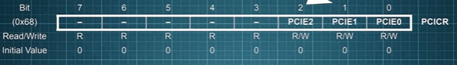

# Lenguaje C
## Modificadores de acceso
### Static
In the C programming language, static is used with global variables and functions to set their scope to the containing file. In local variables, static is used to store the variable in the statically allocated memory instead of the automatically allocated memory. While the language does not dictate the implementation of either type of memory, statically allocated memory is typically reserved in the data segment of the program at compile time, while the automatically allocated memory is normally implemented as a transient call stack.
### Const
The qualifier const can be applied to the declaration of any variable to specify that its value will not be changed (Which depends upon where const variables are stored, we may change the value of const variable by using pointer).
### Volatile
The volatile keyword is intended to prevent the compiler from applying any optimizations on objects that can change in ways that cannot be determined by the compiler. Their values can be changed by code outside the scope of current code at any time. The system always reads the current value of a volatile object from the memory location rather than keeping its value in temporary register at the point it is requested, even if a previous instruction asked for a value from the same object.
**Use cases:**
* Global variables modified by an interrupt service routine outside the scope
* Global variables within a multi-threaded application
### Register
Registers are faster than memory to access, so the variables which are most frequently used in a C program can be put in registers using register keyword. The keyword register
hints to compiler that a given variable can be put in a register. It’s compiler’s choice to put it in a register or not. Generally, compilers themselves do optimizations and put the variables in register.
## Preprocesador
The C preprocessor, often known as cpp, is a macro processor that is used automatically by the C compiler to transform your program before compilation. It is a text substitution tool. Las directivas para el preprocesador comienzan con el simbolo #.
### Directivas
* **define**: substitutes a preprocessor macro
* **include**: inserts a particular header from another file
* undef: undefines a preprocessor macro
* **ifdef**: returns true if the macro is defined
* ifndef: returns true if the macro is *not* defined
* if: tests if a compile time condition is true
* else: alternative for #if
* elif: else if in one statement
* endif: ends preprocessor conditional
* error: prints error message on stderr
* pragma: issues special commands to the compiler, using a standardized method.
* **typedef**: use to give a type a new name

## Caracteres
* Character Constant: constante que representa un valor perteneciente al conjunto de caracteres. Se indica entre comillas simples 'a'.
* Character array: C language does not support strings as a data type, instead they are handled as a one-dimensional array of characters.
### String Handling Functions
C supports a large number of string handling functions that can be used to carry out many of the string manipulations. These functions are packaged in the string.h library.
* strcat(dest,src) concatenates two strings
* strlen(str) show the length of a string
* strrev(str) reverse a string
* strcpy(dest,src) copies one string into another
* strcmp(a,b) compares two strings

## Alcance de variables
In C programming language, variables defined within some function are known as **Local Variables** and variables which are defined outside of function block and are accessible
to entire program are known as **Global Variables**.

## Operadores Logicos
* & -> binary AND
* | -> binary OR
* ^ -> binary XOR
* ~ -> Complemento 1 (invierte los bits)
* << -> binary left shift
* \>> -> binary right shift

**Nota:** La diferencia entre el AND binario (&) y el AND lógico (&&) es que el primero es una operacion que se realiza a nivel de bit.

## Prototipos de funciones
A prototype declares the function name, its parameters, and its return type to the rest of the program prior to the function's actual declaration. Many C compilers do not check for parameter matching either in type or count. You can waste an enormous amount of time debugging code in which you are simply passing one too many or too few parameters by
mistake. **The prototype causes the compiler to check for parameters and flag an error for mismatches on count or type.** Prototypes should be placed at the beginning of your program.

## Punteros y arreglos
Every variable is a memory location, and every memory location has its address defined which can be accessed using ampersand (&) operator, which denotes an address in memory.
```
int main(){
    int var1;
    int var2[10];

    printf("address of var1 %x",&var1);
    printf("address of var2 %x",&var2);

    return 0;
}
```  
**A pointer is a variable whose value is the address of another variable.** Like any variable or constant, you must declare a pointer before using it to store any variable address.
```
int *ip; //pointer to an integer
char str[10]; //pointer to the first element of str array

int num;

ip= &num; //puntero a num

printf(ip); //imprimir direccion de num
printf(*ip); //imprimir contenido de num
```

## Structs
A structure is another *user defined data* type available in C that **allows combining data items of different kinds**. Structures are used to represent a record.
```
struct Books{
    char title[50];
    char author[50];
    char subject[50];
    int id;
}

Books book;

book.title="titulo";
book.author=...
```

## Unions
A union is a special data type available in C that allows to store different data types in the same memory location. You can define a union with many members, but only one member can contain a value at any given time. Unions provide an efficient way of using the same memory location for multiple-purpose. To define a union, you must use the union statement in the same way as you did while defining a structure. The union statement defines a new data type with more than one member for your program.
```
union Data{
    int i;
    float f;
    char str[20];
}data;
```
Now, a variable of Data type can store an integer, a floating-point number, or a string of characters. **It means a single variable, i.e., same memory location, can be used to store multiple types of data**. You can use any built-in or user defined data types inside a union based on your requirement. 

**The memory occupied by a union will be large enough to hold the largest member of the union.**

# Familia de microcontroladores AVR
## Comparativa
<table>
    <tr>
        <th></th>
        <th>Atmega328P</th>
        <th>Atmega2560</th>
    </tr>
    <tr>
        <td>Perifericos</td>
        <td>
            <ul>
                <li>2 8-bit Timer/Counter w/ Separate Prescaler and Compare Mode</li>
                <li>1 16-bit Timer/Counter with Separate Prescaler, Compare Mode, and Capture Mode</li>
                <li>Real Time Counter with Separate Oscillator</li>
                <li>6 PWM Channels</li>
                <li>8-channel 10-bit ADC</li>
                <li>6-channel 10-bit ADC</li>
                <li>Programmable Serial USART</li>
                <li>Master/Slave SPI Serial Interface</li>
                <li>Byte-oriented 2-wire Serial Interface (Philips I2C compatible)</li>
                <li>Programmable Watchdog Timer with Separate On-chip Oscillator</li>
                <li>On-chip Analog Comparator</li>
            </ul>
        </td>
         <td>
            <ul>
                <li>2 8-bit Timer/Counter w/ Separate Prescaler and Compare Mode</li>
                <li>4 16-bit Timer/Counter with Separate Prescaler, Compare Mode, and Capture Mode</li>
                <li>Real Time Counter with Separate Oscillator</li>
                <li>4 8-bit PWM Channels</li>
                <li>12 Programmable resolution (2-16 bits) PWM Channels</li>
                <li>Output Compare Modulator</li>
                <li>8-channel 10-bit ADC</li>
                <li>16-channel 10-bit ADC</li>
                <li>4 Programmable Serial USART</li>
                <li>Master/Slave SPI Serial Interface</li>
                <li>Byte-oriented 2-wire Serial Interface (Philips I2C compatible)</li>
                <li>Programmable Watchdog Timer with Separate On-chip Oscillator</li>
                <li>On-chip Analog Comparator</li>
            </ul>
        </td>
    </tr>
    <tr>
        <td>RAM</td>
        <td>2K Bytes</td>
        <td>8K Bytes</td>
    </tr>
    <tr>
        <td>Flash</td>
        <td>32K Bytes</td>
        <td>256K Bytes</td>
    </tr>
</table>

## Arquitectura AVR (Atmega328P)
### CPU
* RISC: 131 instrucciones de 1 ciclo de reloj (o la mayoría)
* Hardvard: Memoria de programa y memoria de datos con buses independientes
* Basada en registros: 32 de 8 bits.


# Programación de Entrada/Salida
Para controlar los puertos de entrada salida se utilizan los registros:
* DDRn: *Port n Data Direction Register*, define para cada pin su dirección (input/output)
* * **1 is output, 0 is input**
* PORTn: *Port n Data Register* registro usado para setear el estado de los pines del *puerto n*
* PINn: *Port n Input Pin Address*, se utiliza para leer el estado los pines de del *puerto n*, es un registro de solo lectura.
## Funciones de avr libc para evaluar pines
* *PINC & (1<<PINC1)* **-->** bit_is_set (PINC, PINC1)
* *!(PINB & (1<<PINB2))* **-->** bit_is_clear (PINB, PINB2)
* *while( !(ADCSRA & (1<<ADIF)));* **-->** loop_until_bit_is_set (ADCSRA, ADIF);
* *while( ADCSRA & (1<<ADIF) ));* **-->** loop_until_bit_is_clear (ADCSRA, ADIF);
  
# Interrupciones
La CPU de un microcontrolador ejecuta instrucciones secuencialmente, sin embargo, las aplicaciones requieren del uso de diferentes periféricos (internos o externos) y por lo tanto la CPU debe contar con un mecanismo
para interactuar con ellos y dar respuesta adecuada a sus demandas.

Los periféricos generalmente requieren la atención de la CPU de manera aleatoria en respuesta a algún evento. Para poder detectar estos eventos, la alternativa mas simple es la consulta o polling, en la que el CPU debe encargarse "manualmente" de preguntar al dispositivo si se produjo un evento que requiera su atencion. Esto es poco eficiente ya que gastamos ciclos de ejecucion del CPU en esperar a que se produzca un evento.

Un enfoque distinto es permitir al dispositivo que avise a la CPU solo cuando requiera su atencion. De esta manera la CPU se independiza del dispositivo y puede utilizar esos ciclos de ejecucion que gastaba esperando en otra tarea mas productiva. Para esto se utilizan las interrupciones.

Una interrupción es la ocurrencia de un evento producido por algún recurso del
microcontrolador, que ocasiona la suspensión temporal del programa principal.
La CPU atiende al evento con una función conocida como rutina de servicio a la
interrupción (ISR, Interrupt Service Routine). Una vez que la CPU concluye con las
instrucciones de la ISR, continúa con la ejecución del programa principal, regresando
al punto en donde fue suspendida su ejecución.

## Paso por paso
El núcleo AVR cuenta con la **unidad de interrupciones**, un módulo que va a determinar
si se tienen las condiciones para que ocurra una interrupción.
Son tres las condiciones necesarias para que un recurso produzca una interrupción:
* El habilitador global de interrupciones (bit I de ```SREG```) debe estar activado
* El habilitador individual de la interrupción del recurso también debe estar activado
* En el recurso debe ocurrir el evento esperado.

Cuando el microcontrolador se enciende o reinicia, las interrupciones no están habilitadas,
su habilitación requiere la puesta en alto del bit I de SREG y de los habilitadores
individuales de los periféricos incorporados en el microcontrolador.

Al generarse una interrupción, el ```PC``` es almacenado en la pila de datos y a continuacion toma el valor
de una entrada en el vector de interrupciones (según sea la interrupción). Además de desactivar al bit I para no aceptar más interrupciones y finalizar con la instruccion bajo ejecucion en el momento de la interrupcion.

La ISR debe colocarse en una dirección preestablecida por Hardware, la cual corresponde
con un vector de interrupciones.

Una rutina de atención a interrupciones es finalizada con la instrucción ```RETI```, con la
cual el ```PC``` recupera el valor del tope de la pila y pone en alto nuevamente al bit I, para
que la CPU pueda recibir más interrupciones. Ademas, se limpia la flag que genero la interrupcion inicialmente.

## Vectores de interrupcion
El grupo de localidades de memoria destinadas a guardar las direcciones de
las RSI, se llama **“Tabla de Vectores de Interrupción”**

El fabricante reserva direcciones de memoria especificas (llamadas vector) para cada interrupción **con una determinada prioridad dada por el orden que aparecen en la tabla**, en caso que se den varios pedidos de interrupción simultáneamente. El orden (y la prioridad) esta dado por el fabricante.

El fabricante especifica donde disponer de esta tabla, en la mayoría de los uC está al principio de la memoria de programa FLASH o al final.

El mecanismo de vector permite distinguir rápidamente entre múltiples
pedidos de interrupción y determinar su origen para ejecutar a la RSI que
corresponda. Para cada fuente de interrupción distinta debe existir **una sola RSI** asociada
que pueda ejecutarse. El programador diseña la RSI que desea se ejecute en cada caso como si
fuese una función especial.

## RESET
La inicialización o reset de un microcontrolador es fundamental para su operación
adecuada, porque garantiza que sus registros internos van a tener un valor inicial
conocido. Existen varias causas de RESET:

* **Reset de Encendido (Power-on Reset):** El MCU es inicializado cuando el voltaje
de la fuente está por abajo del voltaje de umbral de encendido (V<sub>POT</sub>), el cual tiene
un valor típico de 2.3 V.
* **Reset Externo:** El MCU es inicializado cuando un nivel bajo está presente en la terminal
RESET por un tiempo mayor a 1.5 uS, que es la longitud mínima requerida (t<sub>RST</sub>).
* **Reset por Watchdog:** El MCU es inicializado cuando se ha habilitado al Watchdog
Timer y éste se ha desbordado.
* **Reset por reducción de voltaje (Brown out):** Se inicializa al MCU cuando el
detector de reducción de voltaje está habilitado y el voltaje de la fuente de
alimentación está por debajo del umbral establecido (V<sub>BOT</sub>). El valor de V<sub>BOT</sub> es
configurable a 2.7 V ó 4.0 V, y el tiempo mínimo necesario (t<sub>BOD</sub>) para considerar
una reducción de voltaje es de 2 uS.
* **Reset por JTAG:** El MCU es inicializado tan pronto como exista un 1 lógico en el
Registro de Reset del Sistema JTAG.

**NOTA:**  *JTAG hace referencia a una interfaz serial utilizada para la prueba de circuitos integrados y como medio para depurar sistemas empotrados*

### MCU Status Register
Puesto que hay diferentes causas de reinicio, los AVR incluyen al Registro de Estado
y Control del MCU (```MCUCSR```) en el cual queda indicada la causa de reset por medio de una bandera. Los bits del registro MCUCSR son:

* Bits 7, 6 y 5: No tienen relación con el reset del sistema, en el ATMega8 no están
implementados.
* Bit 4 – JTRF: Bandera de reinicio por JTAG. No está implementada en el ATMega8.
* Bit 3 – WDRF: Bandera de reinicio por desbordamiento del Watchdog timer
* Bit 2 – BORF: Bandera de reinicio por reducción de voltaje (Brown out)
* Bit 1 – EXTRF: Bandera de reinicio desde la terminal de reset
* Bit 0 – PORF: Bandera de reinicio por encendido

## Latencia de interrupcion
Es el tiempo que tarda el Controlador de interrupciones en dar respuesta a
una interrupción, se mide desde que se recibe el pedido hasta que efectivamente se ejecuta la primer instrucción de la RSI correspondiente.

En los AVR la latencia es de 4 ciclos de reloj como mínimo, durante este tiempo, se guarda el PC en la pila, se pone el bit I de ```SREG``` en 0 (desactiva la recepcion de otras interrupciones) y se busca el vector de
interrupción de mayor prioridad que corresponda.

En el caso en que el micro este en modo SLEEP, la latencia es de 8 ciclos.

El retorno de la interrupción (RETI) tambien lleva 4 ciclos.

## Interrupciones anidadas
El anidamiento de interrupciones se da cuando una interrupcion puede interrumpir la rutina de atencion de otra interrupcion. Esto no esta permitido por defecto ya que al atender una rutina se desactivan las interrupciones, sin embargo puede permitirse este comportamiento manualmente si dentro de la rutina se vuelven a habilitar. Una interrupcion en curso solo puede ser interrumpida por otra interrupcion de mayor prioridad.

El anidamiento de interrupciones **no es recomendable** ya que imposibilita la creacion de codigo que se ajuste bien a todas las combinaciones de interrupciones, reduciendo la posibilidad de predecir el comportamiento del sistema, es decir, se pierde confiabilidad ya que no se pueden testear todas las condiciones.

## Interrupciones externas

Las interrupciones externas sirven para detectar un estado lógico o un cambio de estado
en alguna de las terminales de entrada de un microcontrolador, con su uso se evita un
sondeo continuo en la terminal de interés. Son útiles para monitorear interruptores,
botones o sensores con salida a relevador.

En el ATMEGA328p hay dos terminales que pueden generar interrupciones de periféricos externos:

* INT0 (PD2)
* INT1 (PD3)

Estas interrupciones se habilitan con el registro EIMSK – External Interrupt Mask Register. El tipo de activacion es configurable mediante el registro EICRA.

<p style="text-align: center">

<br/><i>Registro IMSK</i><br/>

<br/><i>Registro EICRA</i><br/>
</p>

Las interrupciones externas pueden configurarse para detectar un nivel bajo de voltaje
o una transición, ya sea por un flanco de subida o de bajada

### Activacion Por Flanco vs. Por Nivel
Si una interrupción funciona **por nivel** el periférico que la genera *“coloca y mantiene”* el nivel en la línea para que el uC atienda a esa petición. Durante la atención, el uC debería indicar al periférico externo, de algún modo, que ha sido atendido para que éste libere el nivel de la línea.
* Notar que al no ser una “petición registrada”, si el nivel no está presente cuando las interrupciones están habilitadas, el pedido no será tenido en cuenta.
* Por otro lado, si el periférico no retira el nivel de la línea, continuará solicitando interrupción
indefinidamente.

**Por lo tanto**, las interrupciones por nivel **no tienen memoria** y requieren de un aviso al
periférico para que no se procese la misma interrupción múltiples veces.

Si una interrupción funciona **por flanco** quiere decir que el periférico produce un
flanco en la línea y este pedido queda registrado en un Flag (Flip Flop) pidiendo
interrupción. Típicamente el uC borra este flag para indicar que esta interrupción ya
ha sido atendida sin necesidad de comunicárselo al periférico.

De esta manera, si las interrupciones están deshabilitas al momento de producirse el
flanco, los pedidos quedan “pendientes” y serán atendidos por prioridad cuando se
active la máscara de interrupción I.

<p style="text-align: center">

<br/><i>Activacion por Nivel.</i><br/>

<br/><i>Activacion por Flanco. No hay Acknowledge.</i><br/>
</p>

## Interrupciones por Pin Change (PCINT)

A diferencia de las interrupciones INT0 e INT1 que son capaces de distingar nivel alto, nivel bajo, flanco de subida y flanco de bajada, este tipo de interrupciones se disparan ante cualquier *cambio de nivel* sin distinguir el sentido.

Los interrupciones Pin Change son habilitadas con el registro PCICR, y se habilitan para grupos de pines.


* Bit PCIE0: Cuando esta activado (1) cualquier cambio en los pines PCI7..0 disparara una interrupcion. Los pines se enmascaran desde el registro PCMSK0. El vector de interrupcion asociado es PCINT0_vect.
* Bit PCIE1: Cuando esta activado (1) cualquier cambio en los pines PCI14..8 disparara una interrupcion. Los pines se enmascaran desde el registro PCMSK1. El vector de interrupcion asociado es PCINT1_vect.
* Bit PCIE2: Cuando esta activado (1) cualquier cambio en los pines PCI23..16 disparara una interrupcion.  Los pines se enmascaran desde el registro PCMSK2. El vector de interrupcion asociado es PCINT2_vect.


### Prioridades de atencion
<table>
<tr>
    <th>Vector No.</th>
    <th>Program Address</th>
    <th>Source</th>
    <th>Interrupt Definition</th>
</tr>
<tr>
<td>4</td>
<td>0x0006</td>
<td>PCINT0</td>
<td>Pin change interrupt request 0</td>
</tr>

<td>5</td>
<td>0x0008</td>
<td>PCINT1</td>
<td>Pin change interrupt request 1</td>
</tr>

<td>6</td>
<td>0x000A</td>
<td>PCINT2</td>
<td>Pin change interrupt request 2</td>
</tr>
</table>

# Timer 0
a) Describa los componentes principales del módulo TIMER0 y explique sus modos de funcionamiento.
b) Explique cómo funciona el prescalador (Prescaler) y obtenga una expresión para calcular la frecuencia de
reloj del contador (CLKTn) y la frecuencia de desborde (Overflow) en función de las distintas opciones de fuentes
de reloj. ¿Cómo se borra la bandera de desborde?
c) Si se tiene una frecuencia de CLKIO de 8MHz, establezca con que valores debería inicializar los registros
pertinentes del TIMER0 para realizar un retardo de 1ms. ¿es posible generar un retardo de 1000 ms?
d) Si se tiene una frecuencia de CLKIO de 8MHz, configure TIMER0 para generar una interrupción periódica
de 1ms

# RTC
a) Describa los componentes principales del módulo TIMER0 y explique sus modos de funcionamiento.
b) Explique cómo funciona el prescalador (Prescaler) y obtenga una expresión para calcular la frecuencia de
reloj del contador (CLKTn) y la frecuencia de desborde (Overflow) en función de las distintas opciones de fuentes
de reloj. ¿Cómo se borra la bandera de desborde?
c) Si se tiene una frecuencia de CLKIO de 8MHz, establezca con que valores debería inicializar los registros
pertinentes del TIMER0 para realizar un retardo de 1ms. ¿es posible generar un retardo de 1000 ms?
d) Si se tiene una frecuencia de CLKIO de 8MHz, configure TIMER0 para generar una interrupción periódica
de 1ms

# MEF
¿Qué es un modelo de Estados Finitos? ¿Qué elementos contiene? ¿Cómo se especifica?
b) ¿Cuál es la diferencia entre el modelo propuesto por Moore y el de Mealy?
c) Describa diferentes maneras para implementar en C un modelo MEF, ¿Cómo conviene declarar las
variables de estados? De un ejemplo resumido del código para una posible implementación.
d) ¿Cómo se inicializa una MEF? ¿Cómo se actualiza una MEF?
e) Analice diferencias y similitudes de una implementación MEF en lenguaje C y en lenguaje VHDL partiendo
del mismo modelo de la MEF.

# Planificacion de tareas
a) Explique en qué consiste un esquema de planificación cooperativo con interrupción periódica de timer.
b) Determine el periodo de la interrupción para la planificación de tres tareas periódicas x(), y(), z() con
períodos 10, 25 y 50ms respectivamente. ¿Qué condiciones tiene que asumir para que el funcionamiento del
sistema esté garantizado y sea confiable?
c) Explique mediante pseudocódigo como implementar el planificador y despachador de las tareas y muestre
con un diagrama temporal un ejemplo de la ejecución de las mismas.
d) En el caso de que haya superposición de tareas en el mismo tick de sistema, explique cómo puede hacerse
la planificación del inciso b) para que no haya superposición en la ejecución de x(), y(), z().
e) Explique qué entiende por modularización de software y qué ventajas tiene.
f) Explique la manera de modularizar archivos en C a partir del concepto de clases tomado de la P.O.O.
g) Explique cómo se emplea el modificador static con las funciones, variables y constantes para
modularizar un programa en C.
h) Explique que son las funciones privadas y las funciones públicas de un módulo, de un ejemplo de
implementación de cada una

# Generacion y distribucion de reloj
a) Explique cuáles son las posibles fuentes de reloj y sus rangos de frecuencia para que funcione el MCU.
b) Explique cómo se distribuyen internamente las señales de reloj para la CPU y los distintos periféricos
según las diferentes opciones (diagrama en bloques de la distribución interna de las señales de reloj).
c) Investigue sobre cómo utilizar la biblioteca de funciones de bajo consumo (sleep.h).
d) Explique cuál es la configuración del reloj del sistema dispuesta desde fábrica y que tolerancia tiene la
frecuencia del mismo

# UART
a) Describa las características principales de una comunicación serie asincrónica.
b) Explique cómo funcionan los tres subsistemas principales del módulo UART del Atmega: el generador de
tasa de transmisión (baud rate), el transmisor y el receptor serie. Explique la funcionalidad de los registros
correspondientes.
c) Si se tiene una frecuencia de CLK = 8MHz, encuentre el valor de configuración para obtener tasas de
transferencia de 1200, 2400, 4800, 9600, 19200 y 38400 bps. Determine el error resultante (en %) cometido en
la aproximación respecto a los valores ideales.
d) ¿Cuál es el error máximo respecto al baud rate estándar, que puede aceptarse en una comunicación serie
asincrónica con formato 8N1 para que la comunicación sea confiable?

# Timer 1
a) Describa el funcionamiento y los registros del módulo Timer1. Realice un diagrama en bloques del mismo.
b) Explique cuáles son los posibles modos de funcionamiento.
c) Explique los modos de funcionamiento “Output Compare” de cada canal.
d) Describa un método para generar una señal digital de frecuencia o periodo programable. Analice la resolución
y el rango obtenido en función de los parámetros de configuración.
e) Explique el funcionamiento del modo “Input Capture”.
f) ¿Cómo lo utilizaría para medir el ancho de un pulso? ¿Cómo lo utilizaría para medir la frecuencia o período
de una señal periódica? De un ejemplo de uso. En ambos casos, defina y analice la resolución y el rango de
medida.
g) El sensor de temperatura MAX6577 convierte la temperatura ambiente en una señal digital cuya frecuencia
es proporcional a la temperatura en °C. Investigue la hoja de datos de este dispositivo y diga si es posible utilizar
el Timer1 para medir la temperatura de un ambiente.

# Background Foreground
a) Explique las características más importantes de la arquitectura de software Background / Foreground (eventtriggered).
b) Investigue sobre cómo realizar una implementación de bajo consumo utilizando este tipo de arquitectura de
software. Ayuda: descargue el artículo fore_back_MCU.pdf del aula virtual.
c) Compare la arquitectura Background / Foreground con la utilizada en el TP2. Exponga ventajas y
desventajas.
d) Realice una implementación en pseudocódigo del modelo productor-consumidor para el Receptor y
Transmisor del periférico UART

# SPI I2C
a) Describa cuales son las características principales de una comunicación serie sincrónica SPI. Muestre como
interconectar el microcontrolador con varios dispositivos esclavos genéricos.
b) Explique cómo funcionan el módulo SPI del Atmega. Describa la funcionalidad de los registros
correspondientes.
c) Analice la hoja de datos del DS1302 y explique cómo conectarlo, es decir cual terminal del MCU corresponde
conectar con cual terminal del dispositivo externo.
d) Explique cuáles son las características principales de una comunicación serie sincrónica I2C y como se utiliza
para conectar múltiples dispositivos.
e) Analice la hoja de datos del DS3231 y explique cómo conectarlo a la interfaz TWI (I2C) del microntrolador
Atmega.