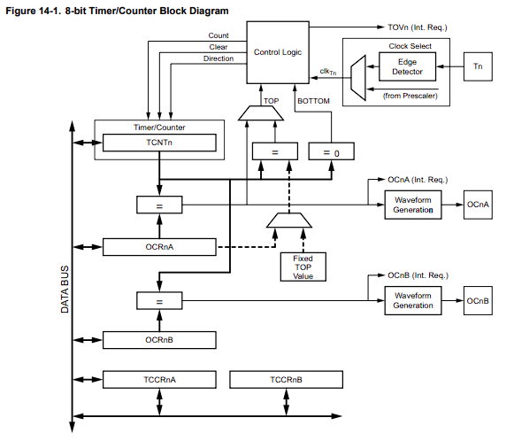
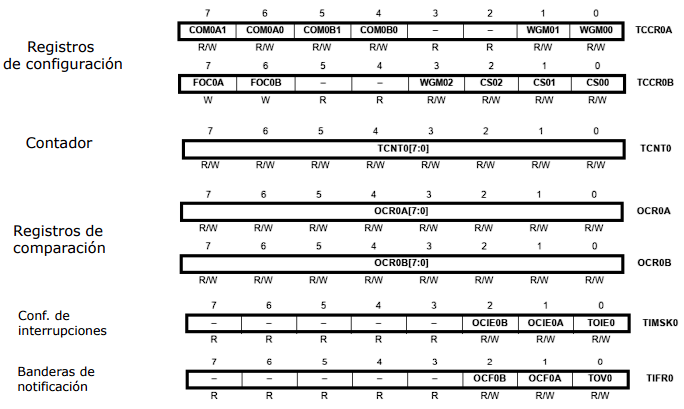
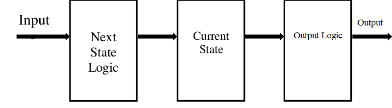
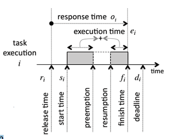
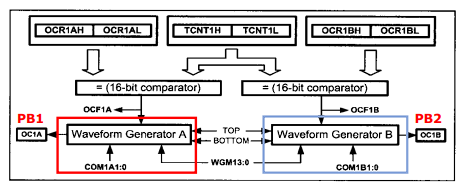
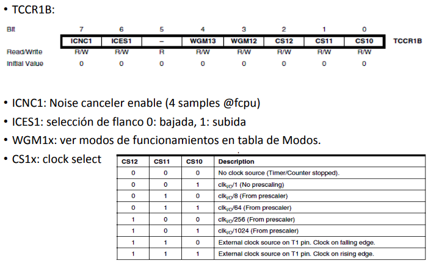
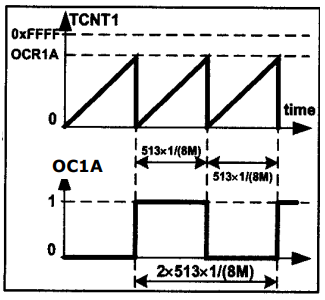
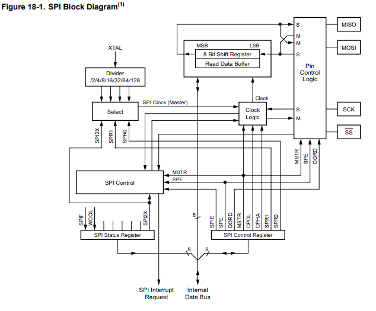
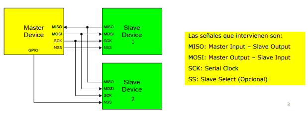
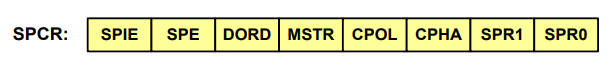

# 1. Apuntes de Clase — Circuitos digitales y Microcontrolares (E0305)

- [1. Apuntes de Clase — Circuitos digitales y Microcontrolares (E0305)](#1-apuntes-de-clase--circuitos-digitales-y-microcontrolares-e0305)
- [2. Lenguaje C](#2-lenguaje-c)
  - [2.1. Modificadores de acceso](#21-modificadores-de-acceso)
    - [2.1.1. Static](#211-static)
    - [2.1.2. Const](#212-const)
    - [2.1.3. Volatile](#213-volatile)
    - [2.1.4. Register](#214-register)
  - [2.2. Preprocesador](#22-preprocesador)
    - [2.2.1. Directivas](#221-directivas)
  - [2.3. Caracteres](#23-caracteres)
    - [2.3.1. String Handling Functions](#231-string-handling-functions)
  - [2.4. Alcance de variables](#24-alcance-de-variables)
  - [2.5. Operadores Logicos](#25-operadores-logicos)
  - [2.6. Prototipos de funciones](#26-prototipos-de-funciones)
  - [2.7. Punteros y arreglos](#27-punteros-y-arreglos)
  - [2.8. Structs](#28-structs)
  - [2.9. Unions](#29-unions)
- [3. Programación modular](#3-programación-modular)
  - [3.1. Comunicación intermodular. Interfaces.](#31-comunicación-intermodular-interfaces)
  - [3.2. Modularización en C](#32-modularización-en-c)
  - [3.3. Plantilla para archivos .h](#33-plantilla-para-archivos-h)
  - [3.4. Plantilla para archivos .c](#34-plantilla-para-archivos-c)
  - [3.5. Header de proyecto](#35-header-de-proyecto)
  - [3.6. Header de puertos o placa](#36-header-de-puertos-o-placa)
  - [3.7. Documentación](#37-documentación)
    - [3.7.1. Ejemplo](#371-ejemplo)
  - [3.8. Convención de nombres](#38-convención-de-nombres)
- [4. Familia de microcontroladores AVR](#4-familia-de-microcontroladores-avr)
  - [4.1. Comparativa](#41-comparativa)
  - [4.2. Arquitectura AVR (Atmega328P)](#42-arquitectura-avr-atmega328p)
    - [4.2.1. CPU](#421-cpu)
- [5. Programación de Entrada/Salida](#5-programación-de-entradasalida)
  - [5.1. Funciones de avr libc para evaluar pines](#51-funciones-de-avr-libc-para-evaluar-pines)
- [6. Interrupciones](#6-interrupciones)
  - [6.1. Paso por paso](#61-paso-por-paso)
  - [6.2. Vectores de interrupcion](#62-vectores-de-interrupcion)
  - [6.3. RESET](#63-reset)
    - [6.3.1. MCU Status Register](#631-mcu-status-register)
  - [6.4. Latencia de interrupcion](#64-latencia-de-interrupcion)
  - [6.5. Interrupciones anidadas](#65-interrupciones-anidadas)
  - [6.6. Interrupciones externas](#66-interrupciones-externas)
    - [6.6.1. Activacion Por Flanco vs. Por Nivel](#661-activacion-por-flanco-vs-por-nivel)
  - [6.7. Interrupciones por Pin Change (PCINT)](#67-interrupciones-por-pin-change-pcint)
    - [6.7.1. Prioridades de atencion](#671-prioridades-de-atencion)
- [7. Periféricos Timer](#7-periféricos-timer)
  - [7.1. Definiciones](#71-definiciones)
- [8. Timer/Counter 0](#8-timercounter-0)
  - [8.1. Modos de funcionamiento](#81-modos-de-funcionamiento)
    - [8.1.1. Normal](#811-normal)
    - [8.1.2. CTC (Clear Timer on Compare Match)](#812-ctc-clear-timer-on-compare-match)
    - [8.1.3. PWM](#813-pwm)
      - [8.1.3.1. Fast PWM](#8131-fast-pwm)
      - [8.1.3.2. Phase Correct PWM](#8132-phase-correct-pwm)
  - [8.2. Prescaler](#82-prescaler)
  - [8.3. Registros para su programación](#83-registros-para-su-programación)
- [9. MEF](#9-mef)
  - [9.1. Modelo de Mealy](#91-modelo-de-mealy)
  - [9.2. Modelo de Moore](#92-modelo-de-moore)
  - [9.3. Implementación en C](#93-implementación-en-c)
    - [9.3.1. Usando switch-case](#931-usando-switch-case)
    - [9.3.2. Usando punteros a función](#932-usando-punteros-a-función)
- [10. Timer 2. RTC](#10-timer-2-rtc)
- [11. Watchdog Timer](#11-watchdog-timer)
- [12. Planificación y Ejecución de Tareas en Sistemas Embebidos](#12-planificación-y-ejecución-de-tareas-en-sistemas-embebidos)
  - [12.1. Super-Loop o Round Robin Cíclico](#121-super-loop-o-round-robin-cíclico)
  - [12.2. Foreground/Background o Event-Driven](#122-foregroundbackground-o-event-driven)
  - [12.3. Time-triggered (disparadas por tiempo)](#123-time-triggered-disparadas-por-tiempo)
  - [12.4. Resumen](#124-resumen)
- [13. Drivers. Modelo Productor/Consumidor.](#13-drivers-modelo-productorconsumidor)
  - [13.1. Estructuras basicas para el intercambio de datos entre tareas](#131-estructuras-basicas-para-el-intercambio-de-datos-entre-tareas)
  - [13.2. Arquitectura Foreground/Background](#132-arquitectura-foregroundbackground)
- [14. RTOS (Real Time Operative System)](#14-rtos-real-time-operative-system)
  - [14.1. Scheduler](#141-scheduler)
  - [14.2. Modelo de tarea](#142-modelo-de-tarea)
  - [14.3. Componentes de un RTOS simple](#143-componentes-de-un-rtos-simple)
- [15. Timer 1](#15-timer-1)
  - [15.1. Accediendo a registros de 16 bits](#151-accediendo-a-registros-de-16-bits)
  - [15.2. Registros](#152-registros)
- [16. Generación de señales con Timer1](#16-generación-de-señales-con-timer1)
  - [16.1. Registro TCCR1A](#161-registro-tccr1a)
  - [16.2. Registro TCCR1B](#162-registro-tccr1b)
  - [16.3. Modo Normal](#163-modo-normal)
  - [16.4. Modo CTC](#164-modo-ctc)
    - [16.4.1. Observaciones](#1641-observaciones)
- [17. Capturación de Entrada con Timer1](#17-capturación-de-entrada-con-timer1)
  - [17.1. Observaciones](#171-observaciones)
- [18. Sistema y fuentes de reloj](#18-sistema-y-fuentes-de-reloj)
  - [18.1. Fuentes](#181-fuentes)
- [19. Comunicación Serie](#19-comunicación-serie)
  - [19.1. Definiciones](#191-definiciones)
- [20. USART](#20-usart)
  - [20.1. Paso por paso](#201-paso-por-paso)
  - [20.2. Registros de control](#202-registros-de-control)
    - [20.2.1. UCSRA](#2021-ucsra)
    - [20.2.2. UCSRB](#2022-ucsrb)
    - [20.2.3. UCSRC](#2023-ucsrc)
      - [20.2.3.1. Frame configuration - Character Size](#20231-frame-configuration---character-size)
- [21. RS-232](#21-rs-232)
    - [21.0.1. Formato de trama](#2101-formato-de-trama)
    - [21.0.2. Control de flujo](#2102-control-de-flujo)
- [22. SPI (Serial Peripheral Interface)](#22-spi-serial-peripheral-interface)
  - [22.1. Registros](#221-registros)
    - [22.1.1. Data Register (SPDR)](#2211-data-register-spdr)
    - [22.1.2. Status Register (SPCR)](#2212-status-register-spcr)
    - [22.1.3. Status Register (SPSR)](#2213-status-register-spsr)
- [23. TWI (2 Wire Interface, I2C)](#23-twi-2-wire-interface-i2c)
  - [23.1. Terminologia](#231-terminologia)
  - [23.2. Transferencia y formato de trama](#232-transferencia-y-formato-de-trama)
    - [23.2.1. Formato de paquete de direcciones](#2321-formato-de-paquete-de-direcciones)
    - [23.2.2. Formato de paquete de datos](#2322-formato-de-paquete-de-datos)
    - [23.2.3. Sincronización](#2323-sincronización)
- [24. Señales PWM (Pulse Width Modulation)](#24-señales-pwm-pulse-width-modulation)

# 2. Lenguaje C
## 2.1. Modificadores de acceso
### 2.1.1. Static
In the C programming language, static is used with global variables and functions to set their scope to the containing file. In local variables, static is used to store the variable in the statically allocated memory instead of the automatically allocated memory. While the language does not dictate the implementation of either type of memory, statically allocated memory is typically reserved in the data segment of the program at compile time, while the automatically allocated memory is normally implemented as a transient call stack.
### 2.1.2. Const
The qualifier const can be applied to the declaration of any variable to specify that its value will not be changed (Which depends upon where const variables are stored, we may change the value of const variable by using pointer).
### 2.1.3. Volatile
The volatile keyword is intended to prevent the compiler from applying any optimizations on objects that can change in ways that cannot be determined by the compiler. Their values can be changed by code outside the scope of current code at any time. The system always reads the current value of a volatile object from the memory location rather than keeping its value in temporary register at the point it is requested, even if a previous instruction asked for a value from the same object.
**Use cases:**
* Global variables modified by an interrupt service routine outside the scope
* Global variables within a multi-threaded application
### 2.1.4. Register
Registers are faster than memory to access, so the variables which are most frequently used in a C program can be put in registers using register keyword. The keyword register
hints to compiler that a given variable can be put in a register. It’s compiler’s choice to put it in a register or not. Generally, compilers themselves do optimizations and put the variables in register.
## 2.2. Preprocesador
The C preprocessor, often known as cpp, is a macro processor that is used automatically by the C compiler to transform your program before compilation. It is a text substitution tool. Las directivas para el preprocesador comienzan con el simbolo #.
### 2.2.1. Directivas
* **define**: substitutes a preprocessor macro
* **include**: inserts a particular header from another file
* undef: undefines a preprocessor macro
* **ifdef**: returns true if the macro is defined
* ifndef: returns true if the macro is *not* defined
* if: tests if a compile time condition is true
* else: alternative for #if
* elif: else if in one statement
* endif: ends preprocessor conditional
* error: prints error message on stderr
* pragma: issues special commands to the compiler, using a standardized method.
* **typedef**: use to give a type a new name

## 2.3. Caracteres
* Character Constant: constante que representa un valor perteneciente al conjunto de caracteres. Se indica entre comillas simples 'a'.
* Character array: C language does not support strings as a data type, instead they are handled as a one-dimensional array of characters.
### 2.3.1. String Handling Functions
C supports a large number of string handling functions that can be used to carry out many of the string manipulations. These functions are packaged in the string.h library.
* strcat(dest,src) concatenates two strings
* strlen(str) show the length of a string
* strrev(str) reverse a string
* strcpy(dest,src) copies one string into another
* strcmp(a,b) compares two strings

## 2.4. Alcance de variables
In C programming language, variables defined within some function are known as **Local Variables** and variables which are defined outside of function block and are accessible
to entire program are known as **Global Variables**.

## 2.5. Operadores Logicos
* & -> binary AND
* | -> binary OR
* ^ -> binary XOR
* ~ -> Complemento 1 (invierte los bits)
* << -> binary left shift
* \>> -> binary right shift

**Nota:** La diferencia entre el AND binario (&) y el AND lógico (&&) es que el primero es una operacion que se realiza a nivel de bit.

## 2.6. Prototipos de funciones
A prototype declares the function name, its parameters, and its return type to the rest of the program prior to the function's actual declaration. Many C compilers do not check for parameter matching either in type or count. You can waste an enormous amount of time debugging code in which you are simply passing one too many or too few parameters by
mistake. **The prototype causes the compiler to check for parameters and flag an error for mismatches on count or type.** Prototypes should be placed at the beginning of your program.

## 2.7. Punteros y arreglos
Every variable is a memory location, and every memory location has its address defined which can be accessed using ampersand (&) operator, which denotes an address in memory.
```c
int main(){
    int var1;
    int var2[10];

    printf("address of var1 %x",&var1);
    printf("address of var2 %x",&var2);

    return 0;
}
```  
**A pointer is a variable whose value is the address of another variable.** Like any variable or constant, you must declare a pointer before using it to store any variable address.
```c
int *ip; //pointer to an integer
char str[10]; //pointer to the first element of str array

int num;

ip= &num; //puntero a num

printf(ip); //imprimir direccion de num
printf(*ip); //imprimir contenido de num
```

## 2.8. Structs
A structure is another *user defined data* type available in C that **allows combining data items of different kinds**. Structures are used to represent a record.
```c
struct Books{
    char title[50];
    char author[50];
    char subject[50];
    int id;
}

Books book;

book.title="titulo";
book.author=...
```

## 2.9. Unions
A union is a special data type available in C that allows to store different data types in the same memory location. You can define a union with many members, but only one member can contain a value at any given time. Unions provide an efficient way of using the same memory location for multiple-purpose. To define a union, you must use the union statement in the same way as you did while defining a structure. The union statement defines a new data type with more than one member for your program.
```c
union Data{
    int i;
    float f;
    char str[20];
}data;
```
Now, a variable of Data type can store an integer, a floating-point number, or a string of characters. **It means a single variable, i.e., same memory location, can be used to store multiple types of data**. You can use any built-in or user defined data types inside a union based on your requirement. 

**The memory occupied by a union will be large enough to hold the largest member of the union.**

# 3. Programación modular
Un módulo puede estar formado por un archivo o una colección de archivos que contienen las funciones que realizan en conjunto la tarea especificada. Los módulos pueden ser verificados y mantenidos por separado, además de que pueden ser desarrollados por un equipo de programadores. 

Un módulo bien desarrollado que cumple con una tarea especifica, puede ser separado del resto y puesto en otra aplicación sin problemas. Un módulo puede verse además como una caja negra que presenta una interfaz bien definida (puntos de entrada y puntos de salida) para comunicarse con el resto del mundo.

## 3.1. Comunicación intermodular. Interfaces.
Las variables globales NO se recomiendan para pasar información de un módulo a otro porque atentan contra la independencia y portabilidad del módulo.

Las interfaces permiten la comunicación entre módulos, determinan la forma de uso de cada uno y garantizan la independencia con el resto del sistema, se implementan mediante los parámetros de entrada de las funciones y los valores de retorno de las mismas.

Ocultar la información que maneja un módulo (por ejemplo los registros del MCU, ciertas variables o funciones) mejora la portabilidad. Este es un concepto básico en la POO (Programación Orientada a Objetos)

Por otro lado, es necesario restringir que módulos acceden al hardware (registros del MCU por ejemplo) y sincronizar los accesos entre los mismos (Mecanismos de sincronización de tareas). Una forma de conectar los módulos es en forma jerárquica (De mayor abstracción a menor abstracción (más cercano al hardware)).

Un módulo (o varios) que controlan el funcionamiento de un dispositivo de hardware constituye un “device driver” . Este contiene el conjunto de funciones necesarias para utilizar un dispositivo particular y provee al usuario una interfaz de comunicación estándar del tipo “open()”,“close()”, “ctr()”, “read()” y “write()”.

## 3.2. Modularización en C
* En C, un archivo puede asemejarse a una "clase".
* Las variables pueden encapsularse con el modificador de acceso *static* y proveyendo métodos Set y Get para accederla.
* Lo mismo aplica para las funciones, recordando que las funciones globales al proyecto deben declarar su prototipo en un .h
* Las constantes definidas en .h son globales al proyecto (public constant), las definidas en .c pertenecen al archivo (private constant)

De esta manera un programa completo puede dividirse en un conjunto de archivos que implementan tareas bien definidas, con reglas claras en el control de acceso a los recursos que manejan y con una interfaz de comunicación bien definida con el resto del mundo.

## 3.3. Plantilla para archivos .h
```c
/*======Evitar inclusión múltiple - begin======*/
#ifndef _NOMBRE_MODULO_H_
#define _NOMBRE_MODULO_H_
/*======Inclusión de dependencias de funciones públicas======*/
#include "dependency.h"
#include <dependency.h>
/*======Para compatibilizar el uso de este módulo desde C++======*/
#ifdef __cplusplus
extern "C"{
#endif
/*======Macros de definición de constantes públicas======*/
#define PI 3.14
/*======Macros "function-like"======*/
#define sum(x,y) ((x)+(y))
/*======Definiciones de tipos de datos públicos======*/
typedef void (*callBackFuncPtr_t)(void *);
/*======Declaración de prototipos (funciones públicas)======*/
bool_t rtcInit(rtc_t* rtc);
/*======Declaración de prototipos (funciones de interrupción públicas)======*/
void UART0_IRQHandler(void);
/*======Para compatibilizar el uso de este módulo desde C++======*/
#ifdef __cplusplus
}
#endif
/*======Evitar inclusión múltiple - end======*/
#endif /* _NOMBRE_MODULO_H_ */
```

## 3.4. Plantilla para archivos .c
```c
/*======Inclusio de cabecera propia======*/
#include "nombreModulo.h"
/*======Inclusión de dependencias de funciones privadas======*/
#include "dependency.h"
/*======Definición de constantes privadas======*/
#define MI_CONSTANTE 9
/*======Macros "function-like" privadas======*/
#define rtcConfig rtcInit
/*======Definición de tipos de datos privados======*/
#typedef void (*FuncPtrPrivado_t)(void *);
/*======Definición de variables globales públicas externas======*/
extern int32_t varGlobalExterna
/*======Definición de variables globales públicas======*/
int32_t varGlobalPublica=0;
/*======Definición de variables globales privadas======*/
static int32_t varGlobalPrivada=0;
/*======Prototipos de funciones privadas======*/
static void funPrivada(void);
/*======Implementaciones de funciones públicas======*/
bool_t rtcInit( rtc_t* rtc){
    // ..
}
/*======Implementaciones de manejadores de interrupciones públicos======*/
void UART0_IRQHandler(void){
    // ..
}
/*======Implementaciones de funciones privadas======*/
static void funPrivada(void){
    // ..
}
```
## 3.5. Header de proyecto
Un cambio en el hardware o en el pin out de la placa donde corre la aplicación, se modificará solo en este archivo y no debería afectar el resto de los módulos.
## 3.6. Header de puertos o placa
Permite definir las interfaces de entrada y salida de la aplicación en particular. Por ejemplo, definiciones de los terminales en las placas arduino X.

## 3.7. Documentación
Los comentarios deben tratar de contener la siguiente información:
* ¿Que hace el programa, módulo o función?
* ¿cuales son las entradas y salidas que produce?
* ¿como lo utilizo?,
* ¿cuales son las condiciones que producen errores?,
* ¿que algoritmo usa?,
* ¿como fue verificado?,
* ¿como hago cambios en el mismo?
* ¿quién es el autor? ¿fecha de creación? ¿logs de modificaciones?
* ¿licencia?... Entre otros…

### 3.7.1. Ejemplo
```c
short int SetPoint; /* Especifica la temperatura deseada para el lazo de control de temperatura. Precisión de 16 bits y en un rango de -55 a +125ºC*/

/***********************************************************************
* Propósito de la función: . . .
* Parámetros de entrada (tipo, rango y formato) : . . .
* Parámetros de salida (tipo, rango y formato) : . . .
* Condiciones de Error de la función (poner ejemplos si hace falta) : . . .
* Macros y su significado : . . .
* Otros comentarios: Autor, fecha y log de modificaciones, etc
***********************************************************************/
int FuncionSuma (int, int);
```

## 3.8. Convención de nombres
* Nombres de variables, ctes y funciones deben ser descriptivos no ambiguos.
* Las variables pueden llevar su tipo como prefijo (pcData, cData, ucData,...)
* Utilizar el nombre del archivo como parte del nombre de las funciones públicas del mismo (LCD_Init(), LCD_write_String(),...)
* Utilizar mayusculas o minusculas para indicar el alcance del objeto
  * Definiciones globales: ``PORTA``, ``TRUE``, ``NULL``, ``FREQ_CPU``, ``PI``
  * Definiciones locales : ``Max``, ``Min``, ``BufferTx``
  * Constantes: Variables locales: ``maxTemp``, ``errorCnt``
  * Variables globales (privadas): ``MaxTemp``, ``ErrorCnt``
  * Variables globales (públicas): ``ADC_Channel``, ``LCD_ErrorCnt``
  * Funciones privadas: ``ClearTime()``, ``Get_Char()``
  * Funciones globales (públicas): ``TIMER_ClearTime()``, ``KEPAD_Get_Char()``

# 4. Familia de microcontroladores AVR
## 4.1. Comparativa
<table>
    <tr>
        <th></th>
        <th>Atmega328P</th>
        <th>Atmega2560</th>
    </tr>
    <tr>
        <td>Perifericos</td>
        <td>
            <ul>
                <li>2 8-bit Timer/Counter w/ Separate Prescaler and Compare Mode</li>
                <li>1 16-bit Timer/Counter with Separate Prescaler, Compare Mode, and Capture Mode</li>
                <li>Real Time Counter with Separate Oscillator</li>
                <li>6 PWM Channels</li>
                <li>8-channel 10-bit ADC</li>
                <li>6-channel 10-bit ADC</li>
                <li>Programmable Serial USART</li>
                <li>Master/Slave SPI Serial Interface</li>
                <li>Byte-oriented 2-wire Serial Interface (Philips I2C compatible)</li>
                <li>Programmable Watchdog Timer with Separate On-chip Oscillator</li>
                <li>On-chip Analog Comparator</li>
            </ul>
        </td>
         <td>
            <ul>
                <li>2 8-bit Timer/Counter w/ Separate Prescaler and Compare Mode</li>
                <li>4 16-bit Timer/Counter with Separate Prescaler, Compare Mode, and Capture Mode</li>
                <li>Real Time Counter with Separate Oscillator</li>
                <li>4 8-bit PWM Channels</li>
                <li>12 Programmable resolution (2-16 bits) PWM Channels</li>
                <li>Output Compare Modulator</li>
                <li>8-channel 10-bit ADC</li>
                <li>16-channel 10-bit ADC</li>
                <li>4 Programmable Serial USART</li>
                <li>Master/Slave SPI Serial Interface</li>
                <li>Byte-oriented 2-wire Serial Interface (Philips I2C compatible)</li>
                <li>Programmable Watchdog Timer with Separate On-chip Oscillator</li>
                <li>On-chip Analog Comparator</li>
            </ul>
        </td>
    </tr>
    <tr>
        <td>RAM</td>
        <td>2K Bytes</td>
        <td>8K Bytes</td>
    </tr>
    <tr>
        <td>Flash</td>
        <td>32K Bytes</td>
        <td>256K Bytes</td>
    </tr>
</table>

## 4.2. Arquitectura AVR (Atmega328P)
### 4.2.1. CPU
* RISC: 131 instrucciones de 1 ciclo de reloj (o la mayoría)
* Hardvard: Memoria de programa y memoria de datos con buses independientes
* Basada en registros: 32 de 8 bits.


# 5. Programación de Entrada/Salida
Para controlar los puertos de entrada salida se utilizan los registros:
* DDRn: *Port n Data Direction Register*, define para cada pin su dirección (input/output)
* * **1 is output, 0 is input**
* PORTn: *Port n Data Register* registro usado para setear el estado de los pines del *puerto n*
* PINn: *Port n Input Pin Address*, se utiliza para leer el estado los pines de del *puerto n*, es un registro de solo lectura.
## 5.1. Funciones de avr libc para evaluar pines
* *PINC & (1<<PINC1)* **-->** bit_is_set (PINC, PINC1)
* *!(PINB & (1<<PINB2))* **-->** bit_is_clear (PINB, PINB2)
* *while( !(ADCSRA & (1<<ADIF)));* **-->** loop_until_bit_is_set (ADCSRA, ADIF);
* *while( ADCSRA & (1<<ADIF) ));* **-->** loop_until_bit_is_clear (ADCSRA, ADIF);
  
# 6. Interrupciones
La CPU de un microcontrolador ejecuta instrucciones secuencialmente, sin embargo, las aplicaciones requieren del uso de diferentes periféricos (internos o externos) y por lo tanto la CPU debe contar con un mecanismo
para interactuar con ellos y dar respuesta adecuada a sus demandas.

Los periféricos generalmente requieren la atención de la CPU de manera aleatoria en respuesta a algún evento. Para poder detectar estos eventos, la alternativa mas simple es la consulta o polling, en la que el CPU debe encargarse "manualmente" de preguntar al dispositivo si se produjo un evento que requiera su atencion. Esto es poco eficiente ya que gastamos ciclos de ejecucion del CPU en esperar a que se produzca un evento.

Un enfoque distinto es permitir al dispositivo que avise a la CPU solo cuando requiera su atencion. De esta manera la CPU se independiza del dispositivo y puede utilizar esos ciclos de ejecucion que gastaba esperando en otra tarea mas productiva. Para esto se utilizan las interrupciones.

Una interrupción es la ocurrencia de un evento producido por algún recurso del
microcontrolador, que ocasiona la suspensión temporal del programa principal.
La CPU atiende al evento con una función conocida como rutina de servicio a la
interrupción (ISR, Interrupt Service Routine). Una vez que la CPU concluye con las
instrucciones de la ISR, continúa con la ejecución del programa principal, regresando
al punto en donde fue suspendida su ejecución.

## 6.1. Paso por paso
El núcleo AVR cuenta con la **unidad de interrupciones**, un módulo que va a determinar
si se tienen las condiciones para que ocurra una interrupción.
Son tres las condiciones necesarias para que un recurso produzca una interrupción:
* El habilitador global de interrupciones (bit I de ```SREG```) debe estar activado
* El habilitador individual de la interrupción del recurso también debe estar activado
* En el recurso debe ocurrir el evento esperado.

Cuando el microcontrolador se enciende o reinicia, las interrupciones no están habilitadas,
su habilitación requiere la puesta en alto del bit I de SREG y de los habilitadores
individuales de los periféricos incorporados en el microcontrolador.

Al generarse una interrupción, el ```PC``` es almacenado en la pila de datos y a continuacion toma el valor
de una entrada en el vector de interrupciones (según sea la interrupción). Además de desactivar al bit I para no aceptar más interrupciones y finalizar con la instruccion bajo ejecucion en el momento de la interrupcion.

La ISR debe colocarse en una dirección preestablecida por Hardware, la cual corresponde
con un vector de interrupciones.

Una rutina de atención a interrupciones es finalizada con la instrucción ```RETI```, con la
cual el ```PC``` recupera el valor del tope de la pila y pone en alto nuevamente al bit I, para
que la CPU pueda recibir más interrupciones. Ademas, se limpia la flag que genero la interrupcion inicialmente.

## 6.2. Vectores de interrupcion
El grupo de localidades de memoria destinadas a guardar las direcciones de
las RSI, se llama **“Tabla de Vectores de Interrupción”**

El fabricante reserva direcciones de memoria especificas (llamadas vector) para cada interrupción **con una determinada prioridad dada por el orden que aparecen en la tabla**, en caso que se den varios pedidos de interrupción simultáneamente. El orden (y la prioridad) esta dado por el fabricante.

El fabricante especifica donde disponer de esta tabla, en la mayoría de los uC está al principio de la memoria de programa FLASH o al final.

El mecanismo de vector permite distinguir rápidamente entre múltiples
pedidos de interrupción y determinar su origen para ejecutar a la RSI que
corresponda. Para cada fuente de interrupción distinta debe existir **una sola RSI** asociada
que pueda ejecutarse. El programador diseña la RSI que desea se ejecute en cada caso como si
fuese una función especial.

## 6.3. RESET
La inicialización o reset de un microcontrolador es fundamental para su operación
adecuada, porque garantiza que sus registros internos van a tener un valor inicial
conocido. Existen varias causas de RESET:

* **Reset de Encendido (Power-on Reset):** El MCU es inicializado cuando el voltaje
de la fuente está por abajo del voltaje de umbral de encendido ($V_{POT}$), el cual tiene
un valor típico de 2.3 V.
* **Reset Externo:** El MCU es inicializado cuando un nivel bajo está presente en la terminal
RESET por un tiempo mayor a 1.5 uS, que es la longitud mínima requerida ($t_{RST}$).
* **Reset por Watchdog:** El MCU es inicializado cuando se ha habilitado al Watchdog
Timer y éste se ha desbordado.
* **Reset por reducción de voltaje (Brown out):** Se inicializa al MCU cuando el
detector de reducción de voltaje está habilitado y el voltaje de la fuente de
alimentación está por debajo del umbral establecido ($V_{BOT}$). El valor de $V_{BOT}$ es
configurable a 2.7 V ó 4.0 V, y el tiempo mínimo necesario ($t_{BOD}$) para considerar
una reducción de voltaje es de 2 uS.
* **Reset por JTAG:** El MCU es inicializado tan pronto como exista un 1 lógico en el
Registro de Reset del Sistema JTAG.

**NOTA:**  *JTAG hace referencia a una interfaz serial utilizada para la prueba de circuitos integrados y como medio para depurar sistemas empotrados*

### 6.3.1. MCU Status Register
Puesto que hay diferentes causas de reinicio, los AVR incluyen al Registro de Estado
y Control del MCU (```MCUCSR```) en el cual queda indicada la causa de reset por medio de una bandera. Los bits del registro MCUCSR son:

* Bits 7, 6 y 5: No tienen relación con el reset del sistema, en el ATMega8 no están
implementados.
* Bit 4 – JTRF: Bandera de reinicio por JTAG. No está implementada en el ATMega8.
* Bit 3 – WDRF: Bandera de reinicio por desbordamiento del Watchdog timer
* Bit 2 – BORF: Bandera de reinicio por reducción de voltaje (Brown out)
* Bit 1 – EXTRF: Bandera de reinicio desde la terminal de reset
* Bit 0 – PORF: Bandera de reinicio por encendido

## 6.4. Latencia de interrupcion
Es el tiempo que tarda el Controlador de interrupciones en dar respuesta a
una interrupción, se mide desde que se recibe el pedido hasta que efectivamente se ejecuta la primer instrucción de la RSI correspondiente.

En los AVR la latencia es de 4 ciclos de reloj como mínimo, durante este tiempo, se guarda el PC en la pila, se pone el bit I de ```SREG``` en 0 (desactiva la recepcion de otras interrupciones) y se busca el vector de
interrupción de mayor prioridad que corresponda.

En el caso en que el micro este en modo SLEEP, la latencia es de 8 ciclos.

El retorno de la interrupción (RETI) tambien lleva 4 ciclos.

## 6.5. Interrupciones anidadas
El anidamiento de interrupciones se da cuando una interrupcion puede interrumpir la rutina de atencion de otra interrupcion. Esto no esta permitido por defecto ya que al atender una rutina se desactivan las interrupciones, sin embargo puede permitirse este comportamiento manualmente si dentro de la rutina se vuelven a habilitar. Una interrupcion en curso solo puede ser interrumpida por otra interrupcion de mayor prioridad.

El anidamiento de interrupciones **no es recomendable** ya que imposibilita la creacion de codigo que se ajuste bien a todas las combinaciones de interrupciones, reduciendo la posibilidad de predecir el comportamiento del sistema, es decir, se pierde confiabilidad ya que no se pueden testear todas las condiciones.

## 6.6. Interrupciones externas

Las interrupciones externas sirven para detectar un estado lógico o un cambio de estado
en alguna de las terminales de entrada de un microcontrolador, con su uso se evita un
sondeo continuo en la terminal de interés. Son útiles para monitorear interruptores,
botones o sensores con salida a relevador.

En el ATMEGA328p hay dos terminales que pueden generar interrupciones de periféricos externos:

* INT0 (PD2)
* INT1 (PD3)

Estas interrupciones se habilitan con el registro EIMSK – External Interrupt Mask Register. El tipo de activacion es configurable mediante el registro EICRA.

<p style="text-align: center">

<br/><i>Registro IMSK</i><br/>

<br/><i>Registro EICRA</i><br/>
</p>

Las interrupciones externas pueden configurarse para detectar un nivel bajo de voltaje
o una transición, ya sea por un flanco de subida o de bajada

### 6.6.1. Activacion Por Flanco vs. Por Nivel
Si una interrupción funciona **por nivel** el periférico que la genera *“coloca y mantiene”* el nivel en la línea para que el uC atienda a esa petición. Durante la atención, el uC debería indicar al periférico externo, de algún modo, que ha sido atendido para que éste libere el nivel de la línea.
* Notar que al no ser una “petición registrada”, si el nivel no está presente cuando las interrupciones están habilitadas, el pedido no será tenido en cuenta.
* Por otro lado, si el periférico no retira el nivel de la línea, continuará solicitando interrupción
indefinidamente.

**Por lo tanto**, las interrupciones por nivel **no tienen memoria** y requieren de un aviso al
periférico para que no se procese la misma interrupción múltiples veces.

Si una interrupción funciona **por flanco** quiere decir que el periférico produce un
flanco en la línea y este pedido queda registrado en un Flag (Flip Flop) pidiendo
interrupción. Típicamente el uC borra este flag para indicar que esta interrupción ya
ha sido atendida sin necesidad de comunicárselo al periférico.

De esta manera, si las interrupciones están deshabilitas al momento de producirse el
flanco, los pedidos quedan “pendientes” y serán atendidos por prioridad cuando se
active la máscara de interrupción I.

<p style="text-align: center">

<br/><i>Activacion por Nivel.</i><br/>

<br/><i>Activacion por Flanco. No hay Acknowledge.</i><br/>
</p>

## 6.7. Interrupciones por Pin Change (PCINT)

A diferencia de las interrupciones INT0 e INT1 que son capaces de distingar nivel alto, nivel bajo, flanco de subida y flanco de bajada, este tipo de interrupciones se disparan ante cualquier *cambio de nivel* sin distinguir el sentido.

Los interrupciones Pin Change son habilitadas con el registro PCICR, y se habilitan para grupos de pines.<br/>
<p style="text-align:center"></p>

* Bit PCIE0: Cuando esta activado (1) cualquier cambio en los pines PCI7..0 disparara una interrupcion. Los pines se enmascaran desde el registro PCMSK0. El vector de interrupcion asociado es PCINT0_vect.
* Bit PCIE1: Cuando esta activado (1) cualquier cambio en los pines PCI14..8 disparara una interrupcion. Los pines se enmascaran desde el registro PCMSK1. El vector de interrupcion asociado es PCINT1_vect.
* Bit PCIE2: Cuando esta activado (1) cualquier cambio en los pines PCI23..16 disparara una interrupcion.  Los pines se enmascaran desde el registro PCMSK2. El vector de interrupcion asociado es PCINT2_vect.

<p style="text-align:center"></p>

### 6.7.1. Prioridades de atencion
<table>
<tr>
    <th>Vector No.</th>
    <th>Program Address</th>
    <th>Source</th>
    <th>Interrupt Definition</th>
</tr>
<tr>
<td>4</td>
<td>0x0006</td>
<td>PCINT0</td>
<td>Pin change interrupt request 0</td>
</tr>

<td>5</td>
<td>0x0008</td>
<td>PCINT1</td>
<td>Pin change interrupt request 1</td>
</tr>

<td>6</td>
<td>0x000A</td>
<td>PCINT2</td>
<td>Pin change interrupt request 2</td>
</tr>
</table>

# 7. Periféricos Timer
Una de las características mas destacables de un MCU es la capacidad de realizar tareas temporizadas, para esto cuentan con un periférico TIMER o TEMPORIZADOR.

Algunas de las aplicaciones pueden ser:
* Generación de retardos
* Interrupción periódica de tiempo-real (planificación de tareas)
* Protección Watch-Dog
* Pero además un Timer se puede utilizar para:
* Generación de señales digitales con frecuencia variables o ciclo de trabajo variable (PWM)
* Medición de frecuencia y ancho de pulso
* Registro y conteo de eventos (COUNTER)

## 7.1. Definiciones

* El **período $T$** de una señal $x(t)$ es el menor numero entero que satisface $x(t)=x(t+T)$
* La **frecuencia $f$**  se define como el numero de oscilaciones en el lapso de 1 seg, es decir $f=1/T$
* El **ciclo de trabajo** de una señal digital es el porcentaje de tiempo en que la misma está activa respecto del periodo total.
* La **Resolución**  es el mínimo período de tiempo medible o contable y es 1 pulso  o período de CLK, dependiendo de la fuente de reloj y prescaler seleccionados
* El **Rango** es el rango de valores (Máx - Mín) que se utiliza para representar la información.
* La **Precisión** es con cuantos bits puedo representar la información. Básicamente es el número del bits del Timer.
* La **Exactitud**  es cuanto difiere el “valor real” respecto al “valor medido”, depende de la exactitud del oscilador que genera la señal del reloj
* La **Estabilidad** es un medida de cuan estable es la frecuencia del CLK frente a perturbaciones en la tensión de alimentación, en la temperatura y al envejecimiento de los componentes. Puede dividirse en estabilidad de corto término y estabilidad a largo plazo.

# 8. Timer/Counter 0
Timer/Counter0 es un modulo Timer/Counter de 8 bits de proposito general, con dos unidades de output-compare independientes, y con soporte para PWM. Permite programar tareas de forma temporizada (event management) y generación de ondas.

<p style="text-align:center"></p>

* **Registro TCNT0:** Registro contador que suma 1 (o resta, segun la direccion de conteo) cada vez que en su entrada hay un flanco de reloj.
* **BOTTOM:** El contador alcanza el valor BOTTOM cuando pasa a 0x00
* **MAX:** El contador alcanza el valor MAX cuando pasa a 0xFF, 255
* **TOP:** Representa el valor más alto de la secuencia de conteo, puede setearse para usar un valor fijo (MAX) o el valor almacenado en el registro **OCR0A**, dependiendo del modo de operación.
* **Clock Select:** La señal de reloj que alimenta al Timer puede provenir del *Prescaler* interno o puede provenir de una señal externa (pin T0). La unidad logica de reloj controla que fuente y que tipo de flanco se utiliza para incrementar o decrementar el valor del Timer/Counter
*  **OCR0A y OCR0B:** Registros utilizados para comparar todo el tiempo el valor del Timer/Counter. Pueden utilizarse para generar un PWM o una salida de frecuencia variable en los pines de output compare (OC0A y OC0B). El evento de Compare match (TCNT0 == OCR0x) activa la flag de comparación (OCF0A o OCF0B), la cual puede usarse para generar una interrupción temporizada.
*  **TCCR0A y TCCR0B:** Son los registros de control del timer, permiten configurar el modo de operación (Normal, CTC, Fast PWM, Phase Correct PWM), el valor de TOP (default o OCR0A), dirección de conteo, activación de flag TOV0 (overflow con bottom, max o top) y el *Prescaler*, entre otros.

## 8.1. Modos de funcionamiento

### 8.1.1. Normal
El Timer/Counter incrementa (o decrementa) el valor de TCNT0 hasta alcanzar el valor TOP (o BOTTOM). Cuando se alcanza, se reinicia el valor TCNT0 a BOTTOM (o TOP) y se levanta el flag TOV0 (overflow).

* La frecuencia de overflow puede calcularse como $f_{OVF} = \frac{f_{clkT_0}}{2^8}$

* El tiempo de overflow puede calcularse como $T_{OVF} = \frac{1}{f_{OVF}}$

* La resolución de temporización puede calcularse como $T_{clkT_0} = \frac{1}{f_{clkT_0}}$

### 8.1.2. CTC (Clear Timer on Compare Match)
El Timer/Counter incrementa (o decrementa) el valor de TCNT0 hasta alcanzar el valor OCR0. Cuando se alcanza, se reinicia el valor TCNT0 a BOTTOM (o OCR0) y se levanta el flag OC0. También puede configurarse para invertir el pulso en el pin OC0 (waveform generation).

### 8.1.3. PWM
#### 8.1.3.1. Fast PWM
#### 8.1.3.2. Phase Correct PWM


## 8.2. Prescaler
El Atmega328P cuenta con un sistema de preescalado de reloj que se utiliza para dividir la frecuencia del reloj y obtener una menor, permitiendo bajar el consumo de energía cuando el requisito de poder de procesamiento es bajo. Este sistema también puede usarse para suministrar señal de reloj a los distintos dispositivos.

El Timer/Counter puede recibir la señal de clock del reloj del sistema ($f_{CLK\_I/O}$), esto permite la velocidad de operacion más rápida. Alternativamente, puede recibir la señal de clock de una de las 4 alternativas del preescalador. Las frecuencias del preescalador son:

$$\frac{f_{CLK\_I/O}}{8}$$
$$\frac{f_{CLK\_I/O}}{64}$$
$$\frac{f_{CLK\_I/O}}{256}$$
$$\frac{f_{CLK\_I/O}}{1024}$$

El prescaler funciona independientemente de la lógica de Clock select, y es compartido por el Timer/Counter1 y el Timer/Counter0.

## 8.3. Registros para su programación


# 9. MEF
> Una Máquina de Estados Finitos (MEF) es un modelo abstracto del “comportamiento” del sistema, basado en principio simples.

> Una Máquina de Estados Finitos (MEF) es un modelo matemático (Teoría general de autómatas) usado para describir el comportamiento de un sistemas que puede ser representado por un número finito de estados, un conjunto de entradas y una función de transición que determina el estado siguiente en función del estado actual y de las entradas.

El modelado de problemas usando MEFs hace más sencilla la comprensión del sistema y su funcionamiento. Desde el punto de vista del software es más sencillo de mantener ya que se pueden agregar o quitar estados sin modificar el resto, es más sencillo de depurar, verificar y optimizar.

Un modelo de MEF debe tener las entradas y las reglas bien definidas para cambiar de estado, sus transiciones se pueden especificar mediante un “diagrama de estados” o “tabla de transiciones de estados” y cada transición implica diferentes respuestas o acciones del sistema.

## 9.1. Modelo de Mealy
En el modelo de Mealy, la **salida** depende del **estado actual** y de las **entradas**. Son propensos a este modelo los sistemas donde la salida provoca el cambio de estado. Por ejemplo, en un robot, el movimiento de sus articulaciones produce el cambio de estado (parado-sentado)
<p style="text-align:center"></p>

## 9.2. Modelo de Moore
En el modelo de Moore, la **salida** del sistema depende solo del **estado actual**. Puede haber múltiples estados con la misma salida, pero para cada estado el significado es diferente. La salida guarda estrecha relacióon con el estado, por ejemplo un controlador de semáforo.
<p style="text-align:center"></p>

**NOTA:** *ambos modelos son intercambiables pero es mejor optar por la forma que representa de manera más natural el problema*

## 9.3. Implementación en C
* Definir conjunto de estados
  * ``enum estados = [STATE0,STATE1,..]``
* Definir conjunto de salidas
  * ``enum salidas = [OUT0,OUT1,..]``
* Definir conjunto de entradas
  * ``enum entradas = [IN0,IN1,..]``
* Definir una función de transición de estados
  * ``tabla : [1..n][1..m]`` 
* Definir procedimiento para establecer el estado inicial
```c
Iniciar_MEF() {
    estado=STATE0;
    salida= OUT0;
}
```
* Definir procedimiento para actualizar la MEF
```c
Actualizar_MEF() {
    Leer(entradas);
    estado=table[estado][entradas];
    Actualizar_Salidas(estado,entradas);
}
```
* Definir procedimiento para ejecutar la MEF
```c
Ejecutar_MEF(){
    Iniciar_MEF();
    repetir siempre{ // <- puede ser temporizada (repetir cada S segundos)
        Actualizar_MEF();
    }
}
```
### 9.3.1. Usando switch-case
En implementaciones con switch, los case de cada estado se evaluarán secuencialmente, equivale a una cadena de if consecutivos de resolución. No tarda lo mismo en ejecutar las actualizaciones según el caso.
```c
typedef enum{S0,S1} state; //definicion y declaracion de variables de estado
state estado;

void Iniciar_MEF{ //metodo de inicialización
    estado=S0;
    Z=0; //salida
}

void ActualizarMEF(void){
    X=leerEntradas();
    switch(estado){
        Case S0:
            if(X==1){
                estado=S1; Z=1;
            }else{
                estado=S0; Z=0;
            }
        break;
        Case S1:
            if(X==1){
                estado=S0; Z=0;
            }else{
                estado=S1; Z=1;
            }
        break;
    }
}
```

### 9.3.2. Usando punteros a función
En implementaciones con punteros a función o tablas el tiempo de acceso a las funciones es el mismo independientemente del valor de la variable de estado, equivale a un desvío selectivo de la ejecución del programa. En general implementaciones con punteros o tablas de transición permiten uniformidad en el tiempo de acceso, son más compactas, pero ocupan más memoria. 

```c
typedef enum{S0,S1} state;
state estado;

void fS0(void);
void fS1(void);

void (*MEF[])(void)={fS0,fS1}; //puntero a funciones


void ActualizarMEF(void){
    X=leerEntradas();
    (*MEF[estado])(); //ejecuta la funcion correspondiente
}

void fS0(void){
    if(X==1){
        estado=S1; Z=1;
    }
    else {
        estado=S0; Z=0;
    }
}

void fS1(void){
    if(X==1){
        estado=S0; Z=0;
    }
    else {
        estado=S1; Z=1;
    }
}

```

# 10. Timer 2. RTC
La única diferencia entre el Timer0 y el Timer2 es la siguiente:

* El Timer0 puede ser alimentado por <mark>una señal de reloj externa</mark> a traves del <mark>pin T0</mark>.

* El Timer2 puede ser alimentado una señal de reloj externa <mark>asíncrona</mark> a traves de los pines <mark>TOSC1 y TOSC2</mark>. Esto quiere decir que puede ser alimentado por un <mark>cristal oscilador</mark> completamente diferente e independiente al de la CPU, de hasta 32kHZ

Una de las cosas que permite el modo asíncrono del Timer2 es la implementación de un **Real-Time-Clock**, que puede contar segundos, minutos, horas, días, meses, indistintamente de lo que este haciendo la CPU o el Oscilador principal. Esto permite que la CPU pueda entrar en modo Sleep mientras que el Timer2 continua contando y solo despierta a la CPU ante un evento de Overflow para incrementar el contador necesario

# 11. Watchdog Timer
El Watchdog timer es un mecanismo de protección ante fallas de software o hardware, básicamente cuenta pulsos de reloj hasta un valor programable y genera una interrupción o un reset cuando alcanza dicho valor; por lo tanto, el software debe reiniciar el contador utilizando la instrucción WDR antes que este alcance la cantidad establecida (o time out). Si por algún motivo el software no reinicia el contador a tiempo se genera una interrupción o un reset.

En modo interrupción puede utilizarse como despertador (wake-up) de un modo de bajo consumo o para limitar el máximo tiempo permitido para una operación dada.

El modo reset se utiliza para reiniciar el sistema ante bloqueos permanentes o código “colgado”

El modo combinado interrupción y reset se utiliza para “guardar el contexto crítico” ante una supuesta falla (safe shutdown). Para configurarlo y activarlo hay que seguir una secuencia segura para evitar activación ocacional.

Este timer se alimenta con un oscilador interno separado de 128kHz. Cuenta con un Prescaler que permite configurar el "*time-out*" a distintos valores (16 ms - 8.0 s)

<p style="text-align:center"></p>

# 12. Planificación y Ejecución de Tareas en Sistemas Embebidos

## 12.1. Super-Loop o Round Robin Cíclico
En este tipo de planificación es dificil temporizar la ejecución ya que las distintas tareas se ejecutaran unicamente después de terminar la previa, que puede tener una duración variable.
```c
/*------------------------------------------------------------------*-
Main.C
------------------------------------------------------------------
Architecture of a simple Super Loop application
-*------------------------------------------------------------------*/
#include "x.h"
#include "y.h"
#include "z.h"
/*------------------------------------------------------------------*/
void main(void){
  X_Init(); // Preparar la tarea X y las condiciones iniciales
  Y_Init(); // Preparar la tarea Y y las condiciones iniciales
  Z_Init(); // Preparar la tarea Z y las condiciones iniciales
  while(1){ // Super Loop
    X(); // Ejecutar la tarea X.
    Y(); // Ejecutar la tarea Y
    Z(); // Ejecutar la tarea Z
  }
}
```
## 12.2. Foreground/Background o Event-Driven
Cada interrupción corresponde a un evento asociado a una tarea específica (múltiples interrupciones). La ejecución de las tareas depende de que el evento ocurra.

Las tareas que se ejecutan en el super-loop se denominan tareas de background y se ejecutan en función de los eventos asociados a las interrupciones.

Las ISR para manejar los eventos asincrónicos se denominan tareas en foreground (también se pueden pensar como hilos de ejecución). Estas ISR deben ser de corta duración, generalmente activan flags o cambian variables de estado de las tareas, para determinar qué procesamiento debe hacerse para ese evento.

El comportamiento No es determinístico. La ISR cambia el flag pero la tarea se procesa cuando le toque el turno en el loop y si no hay otras interrupciones pendientes. Podría darse el caso (es probable) de tener interrupciones simultáneas con lo cual alguna deberá “esperar” a ser atendida, según la prioridad.

La modificación de una tarea de background afecta la temporización de las demás (poca flexibilidad y escalabilidad). Se deben usar funciones “no bloqueantes”.

La comunicación entre el lazo principal (Background task) y las ISR (foreground Task) debe realizarse por medio de variables globales y estas variables de comunicación se convierten en Recursos Compartidos.

Si dos o más tareas acceden simultáneamente a un recurso compartido, el código de acceso al mismo se convierte en una sección crítica de código y deben tomarse medidas por ejemplo deshabilitar las interrupciones.

Administrar los modos de bajo consumo en está arquitectura es complejo ya que debe garantizarse que la CPU ha realizado todas las operaciones de Background y foreground antes de entrar en modo sleep

```c
void main(void) {
  X_Init();
  Y_Init();
  Z_Init();
  sei(); // Globally enable interrupts
  while(1) {
    if (Flag_Z) {
      Z(); //if event Z ocurred->process event Z
      Flag_Z =0; }
    if (Flag_Y) {
      Y(); // if event Y ocurred->process event Y
      Flag_Y =0; }
    if (Flag_X) {
      X(); // if event X ocurred->process event X
      Flag_X =0; }
    }
}
```

```c
/* ------------------------ISR Event X--------------------- */
ISR ( Event_X ){
  Flag_X =1; //event X has ocurred
}
/* ------------------------ISR Event Y--------------------- */
ISR ( Event_Y ){
  Flag_Y =1; //event Y has ocurred
}
/* ------------------------ISR Event Z--------------------- */
ISR ( Event_Z ){
  Flag_Z =1; //event Z has ocurred
}
```

## 12.3. Time-triggered (disparadas por tiempo)
Estas serán tareas planificadas por una única interrupción periódica de Timer comúnmente llamada RTI (Real Time Interrupt). La RTI es la única “base de tiempo” del sistema para temporizar una o más tareas y el manejo de los eventos asincrónicos de los periféricos se realiza exclusivamente por encuesta (polling) periódica.

Cada vez que ocurre la interrupción es como una marca de tiempo o Tick del sistema, que permite planificar que tarea corresponde ejecutar. Cuando la CPU no tenga que ejecutar tareas (zona IDLE) podemos poner el MCU en bajo consumo (SLEEP) hasta el próximo tick y ahorrar energía.

## 12.4. Resumen
<table>
  <tr>
    <th>Super Loop</th>
    <th>Background/Foreground</th>
    <th>Time-Triggered</th>
  </tr>

  <tr>
    <td>
      <ul>
        <li>Simple</li>
        <li>Control x polling</li>
        <li>Sin interrupciones</li>
        <li>Temporización por retardos bloqueantes</li>
      </ul>
    </td>
    <td>
      <ul>
        <li>Las tareas se ejecutan en respuestas a eventos asincrónicos (múltiples interrupciones)</li>
        <li>Difícil de predecir para todas las circunstancias</li>
        <li>Problemas de recursos compartidos (secciones críticas)</li>
      </ul>
    </td>
    <td>
      <ul>
        <li>Única interrupción RTI</li>
        <li>Los periféricos se utilizan por polling periódico</li>
        <li>Cooperativo</li>
        <li>Más confiable para aplicaciones de tiempo real y críticas porque es predecible</li>
      </ul>
    </td>  
  </tr>
</table>

# 13. Drivers. Modelo Productor/Consumidor.
El modelo productor/consumidor se utiliza cuando diferentes tareas dentro de una aplicación producen y consumen gran cantidad de datos a diferentes velocidades. Una solución se basa en el uso de estructuras FIFO (Buffer globales).

* En el contexto de una arquitectura Background/Foreground una tarea productora puede ser un handler de interrupción y la consumidora una tarea de segundo plano o viceversa.

* En el contexto de la planificación Time-Triggered Cooperativa las tareas que producen y consumen datos a diferentes ritmos se implementan como tareas multi-etapas (no bloqueantes)

## 13.1. Estructuras basicas para el intercambio de datos entre tareas

* Buffer o cola: Estructura de datos de tamaño fijo, residente en RAM, que permite alojar temporalmente un conjunto de datos que poseen un determinado orden de llegada y de salida (por ejemplo FIFO).
* Buffer circular (cola circular): un solo buffer y dos punteros, uno para leer y otro para escribir (a diferentes tasas), el tamaño es fijo pero los punteros recorren el mismo de manera circular sin distinguir un
comienzo o un fin del mismo.
* Buffer Ping Pong: se utiliza cuando los datos son producidos y almacenados en grandes volúmenes para su posterior procesamiento. Un buffer es de solo escritura y el otro de solo lectura, cuando se completa un ciclo de transferencia se intercambian entre si. Ejemplo: lectura de discos, memoria de video, USB.

## 13.2. Arquitectura Foreground/Background
```c
main (void){
  tarea1_Init();
  tarea2_Init();
  tarea3_Init();

  sei();
  
  while(1){
    if(evento_tarea1)
      tarea1();
    if(evento_tarea2)
      tarea2();
    if(evento_tarea3)
      tarea3();
  }
}
```
```c
ISR (tarea1){
  …
}
ISR (tarea2){
  …
}
ISR (tarea3){
  …
}
```

# 14. RTOS (Real Time Operative System)
Un sistema operativo de tiempo real es un sistema operativo que provee respuestas a determinados eventos con un “tiempo de respuesta acotado”.

Típicamente, las tareas tienen plazos (deadlines) que son valores de tiempo físico en los cuales se debe completar. Más generalmente, los programas en tiempo real pueden tener todo tipo de restricciones de tiempo, no solo deadlines por ejemplo, puede requerirse que una tarea se ejecute **no antes** de un momento determinado o puede requerirse que se ejecute **no más de una cantidad de tiempo después** de que se ejecute otra tarea, o se le puede solicitar que se ejecute **periódicamente** con un período específico. Las tareas pueden ser dependientes unas de otras y pueden actuar cooperativamente o pueden ser independientes (excepto que todas comparten los recursos del MCU).

En un contexto multitareas donde hay más tareas que CPU o tareas que deben ejecutarse en un tiempo preciso es necesaria la planificación de tareas (**Task scheduling**).

## 14.1. Scheduler
Un planificador (Scheduler) decide cual es la siguiente tarea a ejecutar en el instante de tiempo que la CPU se libera. El planificador puede ser:

* Estatico: Se decide el orden y tiempo de ejecución en el diseño.
* Dinámico: Se decide que tarea ejecutar en tiempo de ejecución.
  
* Preemptive: Puede tomar la decisión de detener la ejecución de una tarea y comenzar la ejecución de otra, aún cuando la anterior no haya finalizado.
* Non-preemptive: Permite a las tareas ejecutarse hasta terminar (run to completion) antes de asignar tiempo de CPU a otra tarea.

El planificador puede utilizar la prioridad de una tarea para decidir cuando corresponde su ejecución. Las tareas pueden tener prioridades fijas o pueden alterarse durante la ejecución de programa.

Un **preemptive priority-based scheduler** siempre ejecuta la tarea habilitada de mayor prioridad mientras que un **non-preemptive priority-based** scheduler usa la prioridad para decidir que tarea corresponde ejecutar luego de que la tarea actual finalice su ejecución y nunca interrumpe la ejecución de una tarea por otra.

## 14.2. Modelo de tarea

* Release time: o también tiempo de despacho, es el tiempo a partir del cual la tarea está habilitada para ejecutarse
* Start time: inicio de la ejecución
* Preemption time: la tarea fue suspendida para ejecutar otra
* Resumption time: la tarea fue reanudada
* Finish time: la tarea finalizó su ejecución
* Deadline: es la restricción de tiempo en el cual la tarea debe completarse. Muchas veces esta limitación proviene de las restricciones físicas impuestas por la aplicación y su no cumplimiento pude ser considerado una falla (en los llamados *hard rtos*) o una degradación de performance (*soft rtos*)
* Response time: es el tiempo de respuesta y se mide desde la habilitación de la tarea hasta la finalización de la misma
* Execution time: es el tiempo que la tarea ha usado la CPU (no tiene en cuenta el tiempo apropiado). Se puede asumir conocido y fijo o con su cota más pesimista WCET (Worst Case Execution time)

<p style="text-align:center"></p>

## 14.3. Componentes de un RTOS simple
* Un planificador de tareas (scheduler) que permite decidir que tarea corresponde ejecutar en base a la temporización basado en una RTI.
* Un despachador de tareas (dispacher) que permita ejecutar las tareas planificadas con distintas prioridades.
* El RTOS y las tareas de aplicación del usuario son parte del mismo proyecto. **No** es una aplicación independiente, pero sí es un módulo portable.

# 15. Timer 1
El Timer/Counter Timer1 es una unidad de 16-bit que permite event management, wave generation y **signal timing measurement**

<p style="text-align:center"></p>

A diferencia de Timer0 y Timer2, en Timer1 los registros *contador* TCNT1*, *output compare* OCR1A/B e *input capture* ICR1 son todos de **16 bits**

## 15.1. Accediendo a registros de 16 bits
Como el bus de datos del Atmega328P es de 8 bits para poder acceder a registros de 16 bits es necesario hacer dos lecturas y dos escrituras

En el caso de una operación de lectura: Debe leerse primero la parte baja. Al leer la parte baja, la parte alta se almacena en el registro TEMP de 8 bits para la subsecuente lectura del mismo.

En el caso de la escritura, el proceso es inverso: Primero escribe en el registro TEMP la parte alta, y luego al escribir la parte baja se copia automaticamente el contenido de TEMP a la parte alta del registro TCNT1.

Este mecanismo permite la escritura y lectura "sincrónica" del registro de 16 bits mientras el contador sigue funcionando y actualizando el registro.

<p style="text-align:center"></p>

## 15.2. Registros
Posee registros similares a los vistos para el Timer0 y Timer2 y adiciona registros para el **capturador de entrada**

# 16. Generación de señales con Timer1
El Timer1 posee 2 canales independientes para la generación de señales



## 16.1. Registro TCCR1A


## 16.2. Registro TCCR1B


## 16.3. Modo Normal
En el modo normal, el contador cuenta hasta TOP (0xFF) e invierte la salida OC1A cuando la cuenta alcanza OCR1A- El periodo de la señal generada es independiente del valor OCR1A


## 16.4. Modo CTC
En el modo CTC la salida de OC1A se invierte cuando TCNT1 alcanza el valor OCR1A, lo que permite controlar la frecuencia o el período de la señal.

$f_{OC1A} = \frac{f_{clk\_I/O}}{2*N*(1+OCR1A)}$ donde $N$ es el Prescaler



### 16.4.1. Observaciones
* Para $f_{clk\_I/O}$ y $N$ fijos, y con $OCR1A$ variable de 16 bits se pueden generar 65536 ($2^{16}$) valores diferentes de $T_{OC1A}$ (o $f_{OC1A}$)
* Para $f_{clk\_I/O}$ y $N$ fijos, y con $OCR1A=0$, el **período mínimo** que se puede generar será $T_{OC1A_Min} = 2*N*1 * T_{clk\_I/O}$
* Para $f_{clk\_I/O}$ y $N$ fijos, y con $OCR1A=65536$, el **período máximo** que se puede generar será $T_{OC1A_MAX} = 2*N*65536 * T_{clk\_I/O}$
* Para $f_{clk\_I/O}$ y $N$ fijos se puede calcular la resolución del período como la diferencia entre dos períodos para dos valores de OCR1A diferentes (x e y)
  $$\Delta T_{OC1A} = T_{OC1A_X} - T_{OC1A_Y}= 2 * N * T_{CLK\_I/O} *(OCR1A_X - OCR1A_Y)$$

# 17. Capturación de Entrada con Timer1
La capturación de entrada me permite medir el tiempo entre flancos de una señal desconocida y así conocer su período.

<p style="text-align:center"></p>

Cuando un cambio en el nivel lógico (un evento) ocurre en el pin de Input Capture (ICP1) y este cambio coincide con la configuración en el detector de flanco, se disparará una captura. Cuando se dispara una captura, el valor del contador de 16 bits (TCNT1) se escribe en el registro ICR1, también de 16 bits. La flag de input capture (ICF1) se activa al mismo tiempo que el valor de TCNT1 se copia al registro ICR1. Si esta habilitada (TICIE1=1), la flag ICF1 genera una interrupción de capturación de entrada (la flag se limpia automaticamente cuando se atiende la interrupción o alternativamente puede ser limpiada por software escribiendo un 1 en su bit location ``TIFR1 |=(1<<ICF1);``).

El comparador analógico, compara la tensión de AIN1 (PB3) contra AIN0 (PB2) y si es mayor, da una salida "1".

Luego, para conocer el período de la señal incógnita
<p style="text-align:center"></p>

$$T_{ICP1} = (ICR1_{t2} - ICR1_{t1}) * N * T_{CLK\_I/O}$$

## 17.1. Observaciones
* Minimo período medible $T_{ICP\_MIN} = 1 * N * T_{CLK\_I/O}$
* Máximo período medible $T_{ICP\_MAX} = 65535 * N * T_{CLK\_I/O}$
* Resolución $\pm N * T_{CLK\_I/O}$

# 18. Sistema y fuentes de reloj
<p style="text-align:center"></p>

* Reloj de CPU $clk_{CPU}$: El reloj de CPU esta conectados a las partes del sistema encargadas de la operacion del núcleo AVR, los módulos tales como el archivo de los registros de propósito general, el registro de estado y la memoria de datos que contiene el stack pointer. Detener el reloj de CPU prohibe al núcleo realizar operaciones generales y cálculos.
* Reloj de I/O $clk_{I/O}$: El reloj de I/O es usado en general por los modulos I/O tales como Timer/Counters, SPI y USART. El reloj I/O tambiñen es usado por el módulo de interrupciones externas, aunque algunas interrupciones externas son asíncronas por lo que pueden ser detectadas aunque el reloj de I/O esté detenido.
* Reloj de Flash $clk_{FLASH}$: El reloj de flash controla las operaciones de la interfaz flash. Generalmente se activa en simultaneo con el reloj de CPU.
* Reloj de Timer Asíncrono $clk_{ASY}$: El reloj asíncrono permite al Timer/Counter asíncrono ser alimentado por un reloj externo o un cristal externo de hasta 32kHz, permitiendo funcionar al Timer/Counter como RTC cuando el dispositivo esta en estado SLEEP.
* Reloj ADC $clk_{ADC}$: El convertidor analógico digital es provisto de su propio reloj para poder detener el reloj de CPU y el reloj de I/O a fin de reducir el ruido generado por los circuitos digitales. Esto permite obtener resultados de conversion más precisos.

## 18.1. Fuentes
1. Low power crystal oscillator: Conectando un cristal de cuarzo en los pines XTAL1 y XTAL2, input y output del oscilador pueden conseguirse frecuencias del rango 0.4 a 16.0 MHz
2. Full swing crystal oscillator: Igual a (1) pero con mayor consumo de energía y como resultado menor ruido en la señal de clk.
3. Low frequency crystal oscillator: Oscilador interno para uso con un cristal de 32.769kHz
4. Internal 128kHz RC oscillator: Oscilador interno calibrado a 128kHz para una tensión de 3V y una temperatura de 25ºC
5. Calibrated internal RC oscillator: Por defecto el oscilador RC interno provee una señal clk aproximada de 8.0Mhz, puede ser calibrado por el usuario pero depende del voltaje y de la temperatura. Con una alimentación de 3V a una temperatura de 25ºC la precisión de la calibración de fábrica es del orden del 2%
6. External Clock: Al utilizar un reloj externo este debe conectarse a la terminal XTAL1. El rango de frecuencia soportado es de 0 a 16Mhz

**Nota:** *el prescaler permite dividir todas las fuentes de reloj por los factores* $2^0$. . . $2^8$

**Nota:** *el Atmega328P trae seteado de fabrica al oscilador RC interno a 8.0Mhz con un divisor programado para obtener una señal resultante de 1Mhz como <mark>fuente por defecto de clk</mark>*

# 19. Comunicación Serie
En una transmisión serie, los datos se envían en paquetes de varios bits, un bit a la vez, por el mismo canal de comunicación.

## 19.1. Definiciones
* Tiempo de bit: tiempo de duración de un bit
* Tasa de transferencia: el numero de bits por unidad de tiempo, tambien se la denomina baud-rate (simbolos por segundo)
* Overhead: son bits o bytes que se agregan al dato para hacer más confiable una transmisión (bits de paridad o bytes de checksum)
* Bandwith o Throughput: es el numero total de bits de información por unidad de tiempo, sin tener en cuenta el overhead
  
* Full-Duplex: Transmisión y recepción en ambos sentidos simultáneamente. Requiere de hardware separados y dos canales de comunicación.
* Half-Duplex: La comunicación es bidireccional por 1 mismo canal, pero no simultáneamente (un problema fundamental de estos sistemas es el manejo de Colisiones)
* Simplex: La comunicación es en un solo sentido.
  
* Sistema sincrónico: el receptor y el transmisor se deben sincronizar a una tasa de transferencia dada, empleando un reloj común a ambos (orientado a la transferencia de bloques de datos). La ventaja es que se pueden utilizar tasas de transferencia más altas, la desventaja es que requiere un conductor adicional (señal de clk).
* Sistema asincrónico: TX y RX no están sincronizados por reloj común, si no que la tasa de transferencia se supone conocida y la trama de datos contiene un bit de comienzo y otro de fin para sincronizar el RX y decodificar los datos (orientado a transferencia de caracteres)

# 20. USART
El Transmisor Receptor Serie Sincrono Asincrono Universal (USART) es un dispositivo de comunicación sere altamente flexible incluído en el Atmega328P.

<p style="text-align:center"></p>

De su diagrama de bloques podemos analizar 3 partes de manera individual:
* Generador de Clock: La lógica de generacion de reloj consiste de logica de sincronización para el input externo de clock usado para la transmisión síncrona en modo esclavo y el generador de *baud rate*. El pin XCKn solo es usado por el modo de transferencia síncrona.
* Transmisor: El transmisor consiste de un único buffer de escritura, un registro de desplazamiento serie, un generador de paridad y lógica de control para manejar diferentes formatos de trama serie. El buffer de escritura permite la transferencia continua de datos sin ningun retraso entre tramas.
* Receptor: El receptor es la parte más compleja del módulo USART, debido a sus unidades de reloj y de data recovery. La unidad de recovery se utiliza para la recepción asincrónica de información. Adicionalmente a las unidades de recovery, el receptor incluye un comprobador de paridad, lógica de control, un registro de desplazamiento y un buffer de recepción de dos niveles. El receptor soporta los mismos formatos de trama que el transmisor y puede detectar errores de trama, sobrecarga de datos (se recibe un dato nuevo y el anterior aun no fue leido) y errores de paridad.
* Registros de control compartidos por todas las unidades

## 20.1. Paso por paso

* Transmisión: Si el registro UDR está vacío (flag UDRE=1) el usuario puede cargar un dato para transmitir. Este inmediatamente se transfiere al shift register y la transmisión comienza. El usuario puede escribir otro dato en el UDR que quedará a la espera de ser transmitido. Esto constituye un mecanismo de doble Buffer. El flag TXC se activa (TXC=1) cuando el transmisor haya completado la transmisión y tanto el UDR como el shift register estén vacios. Ambos flag se borran automáticamente con la escritura de un dato en el UDR.
* Recepción: Los datos presentes en el pin de entrada del periférico son muestreados a una tasa 16 veces mayor a la seleccionada de manera de detectar el bit de comienzo y sincronizarse con el centro de los bits de datos. Una vez detectado el bit de comienzo, los datos son muestreados e introducidos al registro de desplazamiento a medida que son decodificados y hasta detectar el bit de parada o STOP. Luego de completar la recepción el contenido del registro de desplazamiento se transfiere al registro de datos UDR y se activa el flag que indica “dato recibido” RXC. Este flag también puede generar una solicitud de interrupción si se habilita RXCIE. Luego un nuevo dato puede ser recibido, mientras el anterior se encuentra almacenado en el UDR. Esto constituye un mecanismo de doble Buffer

## 20.2. Registros de control

### 20.2.1. UCSRA


* RXC0 (Bit 7): USART Receive Complete 0. This flag bit is set when there are new data in the receive buffer that are not read yet. It is cleared when the receive buffer is empty. It also can be used to generate a receive complete interrupt.
* TXC0 (Bit 6): USART Transmit Complete 0. This flag bit is set when the entire frame in the transmit shift register has been transmitted and there are no new data available in the transmit data buffer register (TXB). It can be cleared by writing a one to its bit location. Also it is automatically cleared when a transmit complete interrupt is executed. It can be used to generate a transmit complete interrupt.
* UDRE0 (Bit 5): USART Data Register Empty 0. This flag is set when the transmit data buffer is empty and it is ready to receive new data. If this bit is cleared you should not write to UDR0 because it overrides your last data. The UDRE0 flag can generate a data register empty interrupt.
* FE0 (Bit 4): Frame Error 0. This bit is set if a frame error has occurred in receiving the next character in the receive buffer. A frame error is detected when the first stop bit of the next character in the receive buffer is zero.
* DOR0 (Bit 3): Data OverRun 0. This bit is set if a data overrun is detected. A data overrun occurs when the receive data buffer and receive shift register are full, and a new start bit is detected.
* PE0 (Bit 2): Parity Error 0. This bit is set if parity checking was enabled (UPM1 = 1) and the next character in the receive buffer had a parity error when received.
* U2X0 (Bit 1): Double the USART Transmission Speed 0
* MPCM0 (Bit 0): Multi-processor Communication Mode 0

### 20.2.2. UCSRB


* RXCIE0 (Bit 7): Receive Complete Interrupt Enable.
* TXCIE0 (Bit 6): Transmit Complete Interrupt Enable.
* UDRIE0 (Bit 5): USART Data Register Empty Interrupt Enable.
* RXEN0 (Bit 4): Receive Enable.
* TXEN0 (Bit 3): Transmit Enable.
* UCSZ02 (Bit 2): Character Size. This bit combined with the UCSZ1:0 bits in UCSRC sets the number of data bits (character size) in a frame.
* RXB80 (Bit 1): Receive data bit 8. This is the ninth data bit of the received character when using serial frames with nine data bits.
* TXB80 (Bit 0): Transmit data bit 8. This is the ninth data bit of the transmitted character when using serial frames with nine data bits

### 20.2.3. UCSRC


* UMSEL01:00 (Bits 7:6): USART Mode Select. These bits select the operation mode of the USART.
  * 00 = Asynchronous USART operation
  * 01 = Synchronous USART operation
  * 10 = Reserved
  * 11 = Master SPI (MSPIM)
* UPM01:00 (Bit 5:4): Parity Mode. These bits disable or enable and set the type of parity generation and check.
  * 00 = Disabled
  * 01 = Reserved
  * 10 = Even Parity
  * 11 = Odd Parity
* USBS0 (Bit 3): Stop Bit Select. This bits selects the number of stop bits to be transmitted.
  * 0 = 1 bit
  * 1 = 2 bits
* UCSZ01:00 (Bit 2:1): Character Size. These bits combined with the UCSZ02 bit in UCSR0B set the character size in a frame.
* UCPOL0 (Bit 0): Clock Polarity. This bit is used for synchronous mode

#### 20.2.3.1. Frame configuration - Character Size


# 21. RS-232
Estándar propuesto por la EIA (Electronics Industry Association) en 1960, para interconectar Data Terminal Equipment y Data Communication Equipment.

Especifica tasas de transferencia no mayor a 20Kbps para distancias de interconexión de 15m y tasas de transferencia hasta 115kbps para distancias más cortas. La interfaz puede operar en modo asincrónico, sincrónico, full-dúplex, half-dúplex o simplex.

Define un 1 lógico (Mark) como una tensión entre -3 y -15V y un 0 lógico (Space) como una tensión entre +3 y +15V. La región (-3,3) no esta definida.

<p style="text-align:center"></p>

### 21.0.1. Formato de trama


El comienzo de flujo de datos se reconoce porque la señal pasa de “marca” a “espacio”. Esta sincronización entre emisor y receptor generalmente se implementa como el bit de arranque.

RS-232 NO especifica como representar caracteres (7 u 8 bits es la forma más común, pero podrían
ser 5, 6 ó 9).

Tampoco el bit de paridad (que es opcional, depende de la implementación):
* No Parity (sin paridad)
* Even Parity (paridad “par”): el bit de paridad es uno (1) para que haya una cantidad par de unos.
* Odd Parity (paridad “impar”): el bit de paridad es uno (1) para que haya una cantidad impar de unos.

Después del bit de paridad (si lo hay) continúan los bits de parada (stop bits) que pueden ser 1, 1.5 o 2 dependiendo la implementación.

El formato de trama más utilizado es el formato 8N1, con un bit de start, 8 bits de dato y un bit de stop, sin bits de paridad.

### 21.0.2. Control de flujo
El control de flujo es indicar al emisor cuando puede transmitir y cuando debe esperar. En RS-232 puede implementarse por software o hardware

* Por software: se envía un caracter (ASCII 19) para indicar al emisor que el buffer de recepción está lleno, y un carácter (ASCII 17) para indicar que puede volver a transmitir
* Por hardware:  requiere que entre el receptor y el emisor se conecten dos hilos más: RTS y CTS. Cuando el buffer del receptor se llena desactiva la señal CTS, el emisor debe esperar. Cuando vuelva a tener espacio en el buffer, activa nuevamente el CTS para decir que está nuevamente listo.

# 22. SPI (Serial Peripheral Interface)
SPI Es una interfaz desarollada por Motorola en 1991, permite comunicación serie full duplex **sincrónica** con dispositivos periféricos u otros MCU y altas tasas de transferencia de hasta 10Mbits/s.
Utiliza una configuracion Master-Slave donde el master genera y distribuye la señal de reloj, y opcionalmente utiliza una línea de seleción de chip por cada dispositivo esclavo.

<p style="text-align:center"></p>
El sistema consiste de dos registros de desplazamiento, y un generador de clock maestro. El SPI master inicia el ciclo de comunicación *pulleando a low* el pin Slave Select (SS) del Slave deseado. Luego, maestro y esclavo se preparan para recibir información en sus respectivos registros de desplazamiento, y el maestro genera los pulsos de reloj necesarios en la linea SCK para intercambiar información. La información siempre es desplazada desde el maestro hacia el esclavo en la linea MOSI, y desde el esclavo hacia el maestro en la linea MISO. Luego de cada paquete de datos, el maestro sincroniza al esclavo *pulleando a high* la linea SS.

**Cuando se configura como maestro**, la SPI no tiene control automatico de la linea SS, esta debe ser manejada por el software antes de que comience la comunicación. Luego de esto, escribir en el registro de datos de la SPI inicia el generador de clock y el hardware desplaza los 8 bits al esclavo. Luego de desplazar 1 byte, el generador de reloj se detiene, seteando la flag de fin de transmisión (SPIF).
Si el bit de interrupción de la SPI está activado (SPIE) en el registro (SPCR), se genera una interrupción. El maestro puede continuar desplazando el proximo byte escribiendolo en SPDR o indicar el fin de paquete, pulleando high la linea SS. El ultimo byte se mantiene en el buffer del registro para su uso posterior.

**Cuando se configura como esclavo**, la SPI se mantiene "durmiendo" con la linea MISO *tri-stated*, mientras el pin SS se mantenga high. Mientras MISO está en este estado, el software puede actualizar el contenido del registro de datos de la SPI (SPDR) pero los datos no serán desplazados por pulsos entrantes en el pin SCK hasta que el pin SS sea pulleado a low. Cuando se completa el desplazamiento de un byte, se setea la flag de fin de transmision (SPIF). Si las interrupciones estan habilitadas (seteando el bit SPIE del registro SPCR), se generará una interrupción. El esclavo puede continuar colocando nuevos datos para ser envíados en el registro SPDR antes de leer datos entrantes. El ultimo dato entrante se mantendrá en el buffer del registro para su uso posterior.

Se usa single buffer para la transmisión y buffer doble para la recepción. Esto significa que los butes para ser transmitidos no puede ser escritos al registro de datos de la SPI antes de que el ciclo de desplazamiento se complete. Sin embargo, cuando se recibe información, el byte recibido debe ser leido del registro de datos de la SPI antes de que se reciba un nuevo byte. De lo contrario, se pierde el primero.

<table>
<tr>
<td></td>
<td></td>
</tr>
</table>

<table>
<tr><th>Ventajas</th><th>Desventajas</th></tr>
<tr>
  <td>
    <ul>
      <li>No está limitado a la transferencia de bloques de 8 bits, ni al orden de transmisión de los bits</li>
      <li>Libre elección del tamaño de la trama de bits, de su significado y su propósito</li>
      <li>Permite seleccionar cuatro modos de operación (polaridad-fase)</li>
      <li>No es necesario arbitraje o mecanismos de respuesta ante fallos</li>
      <li>Los dispositivos esclavos usan el reloj que envía el maestro, no necesitan por tanto su propio reloj y este puede configurarse según la aplicación.</li>
      <li>Un dispositivo puede utilizarse para solo transmitir, sólo recibir o ambas cosas a la vez</li>
      <li>Existen diferentes versiones para aumentar la eficiencia de la transeferencia (Dual SPI, Quad SPI, QPI)</li>
    </ul>
  </td>
  <td>
    <ul>
      <li>Requiere más terminales de conexion que TWI</li>
      <li>El direccionamiento se hace mediante lineas de seleccion de chip</li>
      <li>No posee control de flujo por hardware</li>
      <li>No posee mecanismos de reconocimiento (el maestro podria enviar informacion sin que estuviesen conectados los esclavos)</li>
      <li>No permite más de un maestro conectado al bus</li>
    </ul>
  </td>
<tr>
</table>

## 22.1. Registros

### 22.1.1. Data Register (SPDR)

### 22.1.2. Status Register (SPCR)


* SPIE (SPI Interrupt Enable)
* SPE (SPI Enable)
* DORD (Data Order)
* MSTR (Master)
* CPOL (Clock Polarity)
* CPHA (Clock Phase)
* SPR1,SPR0: SPI Clock Rate

<table>
<tr><th>Mode Select</th><th>SCK Frequency</th></tr>
<tr>
<td></td>
<td></td>
</tr>
</table>

### 22.1.3. Status Register (SPSR)


* SPIF (SPI Interrupt Flag): Transferencia completa (tx & rx)
* WCOL (Write Collision): Registro SPDR escrito durante transferencia de datos
* SPI2X (Double SPI Speed): Duplicar la frecuencia de SCK duplica cuando el SPI esta en modo maestro

# 23. TWI (2 Wire Interface, I2C)
La interfaz TWI es ideal para aplicaciones típicas de microcontroladores. El protocolo TWI permite al diseñador de sistemas interconectar hasta 128 dispositivos diferentes usando solo un bus de dos lineas bi-direccionales, una para reloj (SCL) y otra para datos (SDA). El unico hardware externo necesario para implementar el bus es un único resistor de pull up por cada una de las lineas del bus TWI. Todos los dispositivos conectados al bus tienen direcciones individuales y los mecanismos para resolver la contención en el bus son inherentes al protocolo TWI

## 23.1. Terminologia


* Maestro: Inicia y termina la transmision, genera el reloj en la linea SCL
* Esclavo: El dispositivo dirigido por un maestro
* Transmisor: El dispositivo que pone datos en el bus
* Receptor: El dispositivo que lee datos del bus

## 23.2. Transferencia y formato de trama
Cada bit de datos se transmite en el bus TWI acompañado de un pulso de reloj en la linea SCL, el nivel de la línea de datos debe ser estable durante el pulso alto de reloj, excepto al generar las condiciones de START y STOP.

El maestro es el encargado de inciar y terminar las transmisiones de datos. La transmisión se inicia cuando el maestro emite una condición de START en el bus, y se termina cuando emite una de STOP. Entre las condiciones de START  y STOP el bus se considera ocupado y ningun Maestro debe intentar tomar control del bus. Se produce un caso especial cuando se emite una nueva condición de START entre una condición de START y una de STOP. Esto se denomina condición de REPEATED START y se utiliza cuando el maestro desea iniciar una nueva transferencia sin renunciar al control del bus. Luego de un REPEATED START el bus se considera ocupado hasta el siguiente STOP (START y REPEATED START son identicos).

La señal de START y STOP se generan con un flanco de bajada y uno de subida respectivamente, junto con un pulso alto en la linea SCL.

### 23.2.1. Formato de paquete de direcciones
Todos los paquetes de direcciones transmitidos en el bus TWI son de 9 bits, constando de 7 bits de direcciones, 1 bit de READ/WRITE (1/0) y 1 bit de acknowledge. Cuando un esclavo reconoce que esta siendo direccionado por el maestro, debe pullear low la linea SDA durante el 9º ciclo de SCL (el ciclo de ACK). Luego el maestro puede transmitir una condición de STOP o REPEATED START para iniciar a transmitir.

**Nota:** *Un paquete de direcciones con directiva de lectura se denomina **SLA+R**, uno con directiva de escritura **SLA+W**.*

El bit más significativo (MSB) se transmite primero. Las direcciones de esclavo pueden alocarse libremente por el diseñador, pero la direccion 0000 000 está reservada para *llamado general*. Una llamada general se usa cuando el maestro quiere transmitir el mismo mensaje a varios esclavos del sistema. Las llamadas generales no tienen sentido para lectura ya que se producirian colisiones en el bus.

**Nota:** *Todas las direcciones de formato 1111 xxx deberían estar reservadas para futuros propositos*

### 23.2.2. Formato de paquete de datos
Todos los paquetes de datos transmitidos en el bus TWI son de 9 bits, constando de 1 byte de datos y 1 bit de acknowledge. Durante una transferencia de datos, el maestro genera el reloj y las condiciones de START y STOP, mientras que el receptor es responsable del acknowledge de la recepción. El acknowledge (ACK) es emitido por el receptor pulleando la linea SDA a low durante el 9º ciclo de SCL. El MSB de los datos se transmite primero.

### 23.2.3. Sincronización
El esclavo puede extender el periodo low de la linea SCL pulleando a low la misma, esto es util para si la velocidad de reloj del maestro es demasiado rapida para el esclavo o para obtener tiempo extra de procesamiento. Esta extension del periodo de SCL no afecta al periodo alto de la misma, el cual es determinado por el maestro. Como consecuencia, el esclabo puede reducir la velocidad de transferencia al prolongar el ciclo de trabajo de SCL.

# 24. Señales PWM (Pulse Width Modulation)
Pulse Width Modulation es una técnica de modulación digital donde la información útil de la señal se encuentra en el ancho del pulso. Esto permite que se pueda obtener una señal analógica a partir de una señal digital, y controlar dispositivos analogicos por medio de salidas digitales.
